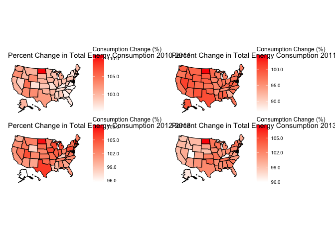
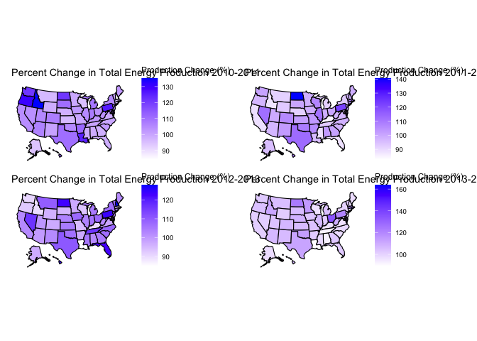
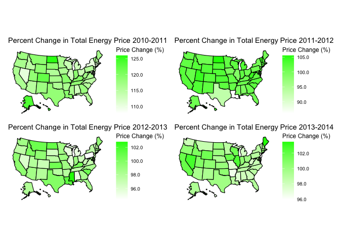
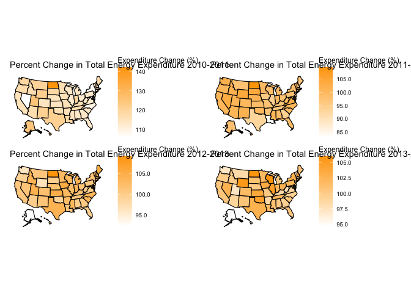
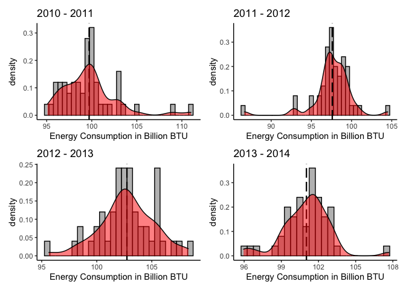
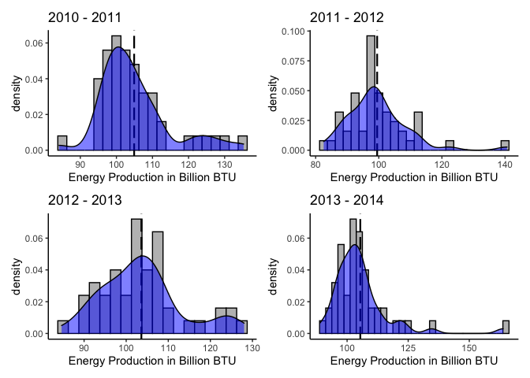
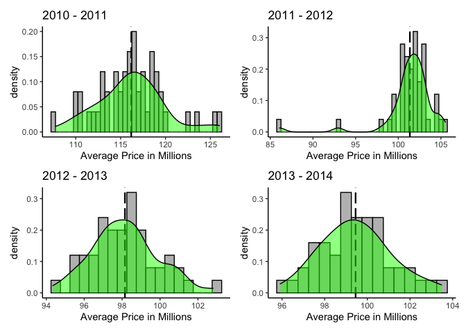
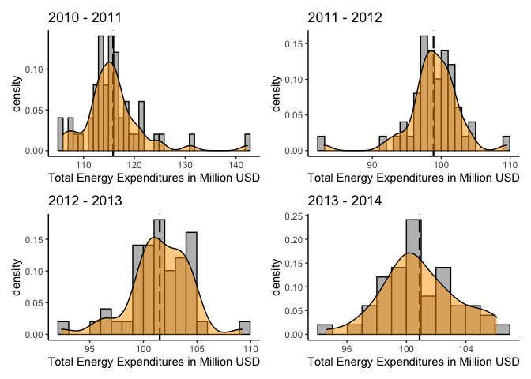
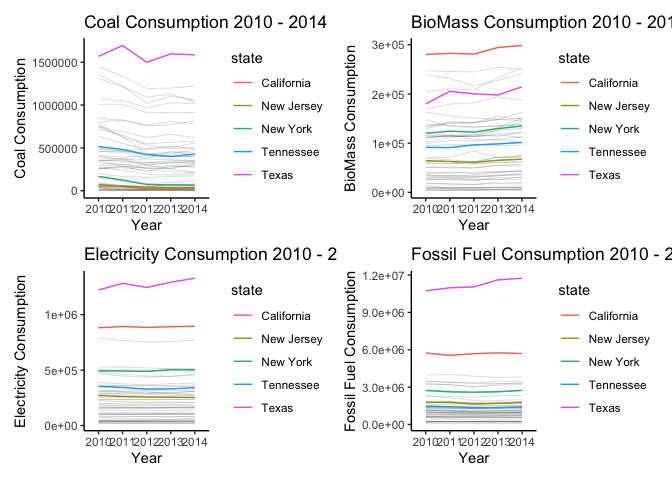
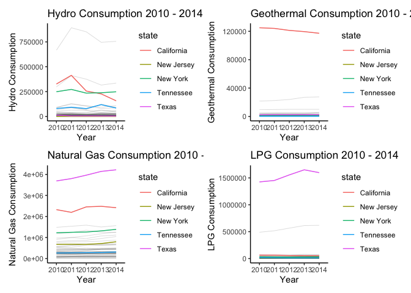

Donald Kane
================

Find the correlation between energy consumption, production and
expenditures and use scatterplot with a regression line to show the
relationship. (scatterplot)

## Use U.S. maps to show the consumption and expenditures of coal, petroleum, etc. Find each state’s consumption to GDP correlation. (US map plots, scatterplots, correlation)

``` r
library(readr)
library(usmap)
library(ggplot2)
library(tidyverse)
```

    ## ── Attaching packages ─────────────────────────────────────── tidyverse 1.3.1 ──

    ## ✓ tibble  3.1.5     ✓ dplyr   1.0.7
    ## ✓ tidyr   1.1.4     ✓ stringr 1.4.0
    ## ✓ purrr   0.3.4     ✓ forcats 0.5.1

    ## ── Conflicts ────────────────────────────────────────── tidyverse_conflicts() ──
    ## x dplyr::filter() masks stats::filter()
    ## x dplyr::lag()    masks stats::lag()

``` r
library(patchwork)
```

``` r
Energy_Census_and_Economic_Data_US_2010_2014 <- read_csv("Energy Census and Economic Data US 2010-2014.csv")
```

    ## Rows: 52 Columns: 192

    ## ── Column specification ────────────────────────────────────────────────────────
    ## Delimiter: ","
    ## chr   (2): StateCodes, State
    ## dbl (190): Region, Division, Coast, Great Lakes, TotalC2010, TotalC2011, Tot...

    ## 
    ## ℹ Use `spec()` to retrieve the full column specification for this data.
    ## ℹ Specify the column types or set `show_col_types = FALSE` to quiet this message.

``` r
Energy_Census_and_Economic_Data_US_2010_2014 <- Energy_Census_and_Economic_Data_US_2010_2014[1:51,]
View(Energy_Census_and_Economic_Data_US_2010_2014)
```

``` r
data <- Energy_Census_and_Economic_Data_US_2010_2014 %>%
  filter(State != "District of Columbia") %>%
  filter(State != "United States")
colnames(data)[2] <- "state"

pcc1 <- plot_usmap(data = data, values = "TotalC10-11", color = "black") + 
  scale_fill_continuous(name = "Consumption Change (%)", label = scales::comma, low = "white", high = "red") + 
  theme(legend.position = "right") +
  labs(
    title = "Percent Change in Total Energy Consumption 2010-2011"
  )

pcc2 <- plot_usmap(data = data, values = "TotalC11-12", color = "black") + 
  scale_fill_continuous(name = "Consumption Change (%)", label = scales::comma, low = "white", high = "red") + 
  theme(legend.position = "right") +
  labs(
    title = "Percent Change in Total Energy Consumption 2011-2012"
  )

pcc3 <- plot_usmap(data = data, values = "TotalC12-13", color = "black") + 
  scale_fill_continuous(name = "Consumption Change (%)", label = scales::comma, low = "white", high = "red") + 
  theme(legend.position = "right") +
  labs(
    title = "Percent Change in Total Energy Consumption 2012-2013"
  )

pcc4 <- plot_usmap(data = data, values = "TotalC13-14", color = "black") + 
  scale_fill_continuous(name = "Consumption Change (%)", label = scales::comma, low = "white", high = "red") + 
  theme(legend.position = "right") +
  labs(
    title = "Percent Change in Total Energy Consumption 2013-2014"
  )

pcc1 + pcc2 + pcc3 + pcc4
```

<!-- -->

``` r
pcp1 <- plot_usmap(data = data, values = "TotalP10-11", color = "black") + 
  scale_fill_continuous(name = "Production Change (%)", label = scales::comma, low = "white", high = "blue") + 
  theme(legend.position = "right") +
  labs(
    title = "Percent Change in Total Energy Production 2010-2011"
  )

pcp2 <- plot_usmap(data = data, values = "TotalP11-12", color = "black") + 
  scale_fill_continuous(name = "Production Change (%)", label = scales::comma, low = "white", high = "blue") + 
  theme(legend.position = "right") +
  labs(
    title = "Percent Change in Total Energy Production 2011-2012"
  )

pcp3 <- plot_usmap(data = data, values = "TotalP12-13", color = "black") + 
  scale_fill_continuous(name = "Production Change (%)", label = scales::comma, low = "white", high = "blue") + 
  theme(legend.position = "right") +
  labs(
    title = "Percent Change in Total Energy Production 2012-2013"
  )

pcp4 <- plot_usmap(data = data, values = "TotalP13-14", color = "black") + 
  scale_fill_continuous(name = "Production Change (%)", label = scales::comma, low = "white", high = "blue") + 
  theme(legend.position = "right") +
  labs(
    title = "Percent Change in Total Energy Production 2013-2014"
  )
pcp1 + pcp2 + pcp3 + pcp4
```

<!-- -->

``` r
pcpr1 <- plot_usmap(data = data, values = "TotalPrice10-11", color = "black") + 
  scale_fill_continuous(name = "Price Change (%)", label = scales::comma, low = "white", high = "green") + 
  theme(legend.position = "right") +
  labs(
    title = "Percent Change in Total Energy Price 2010-2011"
  )

pcpr2 <- plot_usmap(data = data, values = "TotalPrice11-12", color = "black") + 
  scale_fill_continuous(name = "Price Change (%)", label = scales::comma, low = "white", high = "green") + 
  theme(legend.position = "right") +
  labs(
    title = "Percent Change in Total Energy Price 2011-2012"
  )

pcpr3 <- plot_usmap(data = data, values = "TotalPrice12-13", color = "black") + 
  scale_fill_continuous(name = "Price Change (%)", label = scales::comma, low = "white", high = "green") + 
  theme(legend.position = "right") +
  labs(
    title = "Percent Change in Total Energy Price 2012-2013"
  )

pcpr4 <- plot_usmap(data = data, values = "TotalPrice13-14", color = "black") + 
  scale_fill_continuous(name = "Price Change (%)", label = scales::comma, low = "white", high = "green") + 
  theme(legend.position = "right") +
  labs(
    title = "Percent Change in Total Energy Price 2013-2014"
  )

pcpr1 + pcpr2 + pcpr3 + pcpr4
```

<!-- -->

``` r
pce1 <- plot_usmap(data = data, values = "TotalE10-11", color = "black") + 
  scale_fill_continuous(name = "Expenditure Change (%)", label = scales::comma, low = "white", high = "orange") + 
  theme(legend.position = "right") +
  labs(
    title = "Percent Change in Total Energy Expenditure 2010-2011"
  )

pce2 <- plot_usmap(data = data, values = "TotalE11-12", color = "black") + 
  scale_fill_continuous(name = "Expenditure Change (%)", label = scales::comma, low = "white", high = "orange") + 
  theme(legend.position = "right") +
  labs(
    title = "Percent Change in Total Energy Expenditure 2011-2012"
  )

pce3 <- plot_usmap(data = data, values = "TotalE12-13", color = "black") + 
  scale_fill_continuous(name = "Expenditure Change (%)", label = scales::comma, low = "white", high = "orange") + 
  theme(legend.position = "right") +
  labs(
    title = "Percent Change in Total Energy Expenditure 2012-2013"
  )

pce4 <- plot_usmap(data = data, values = "TotalE13-14", color = "black") + 
  scale_fill_continuous(name = "Expenditure Change (%)", label = scales::comma, low = "white", high = "orange") + 
  theme(legend.position = "right") +
  labs(
    title = "Percent Change in Total Energy Expenditure 2013-2014"
  )

pce1 + pce2 + pce3 + pce4
```

<!-- -->

## Show distribution of energy consumption (bar graph)

``` r
c1 <- data %>%
  ggplot(aes(`TotalC10-11`)) +
  geom_histogram(aes(y = ..density..),
                 binwidth = .5, color = "black", fill = "gray") +
  geom_vline(aes(xintercept = mean(`TotalC10-11`, na.rm = T)),
          colour = "black", linetype ="longdash", size = .8) +
  geom_density(alpha = 0.5, fill = "red") + 
  theme_classic() + 
  labs(
    title = "2010 - 2011",
    x = "Energy Consumption in Billion BTU"
  )

c2 <- data %>%
  ggplot(aes(`TotalC11-12`)) +
  geom_histogram(aes(y = ..density..),
                 binwidth = .5, color = "black", fill = "gray") +
  geom_density(alpha = 0.5, fill = "red") +
  geom_vline(aes(xintercept = mean(`TotalC11-12`, na.rm = T)),
          colour = "black", linetype ="longdash", size = .8) +
  theme_classic() + 
  labs(
    title = "2011 - 2012",
    x = "Energy Consumption in Billion BTU"
  )

c3 <- data %>%
  ggplot(aes(`TotalC12-13`)) +
  geom_histogram(aes(y = ..density..),
                 binwidth = .5, color = "black", fill = "gray") +
  geom_vline(aes(xintercept = mean(`TotalC12-13`, na.rm = T)),
          colour = "black", linetype ="longdash", size = .8) +
  geom_density(alpha = 0.5, fill = "red") +
  theme_classic() + 
  labs(
    title = "2012 - 2013",
    x = "Energy Consumption in Billion BTU"
  )

c4 <- data %>%
  ggplot(aes(`TotalC13-14`)) +
  geom_histogram(aes(y = ..density..),
                 binwidth = .5, color = "black", fill = "gray") +
  geom_vline(aes(xintercept = mean(`TotalC13-14`, na.rm = T)),
          colour = "black", linetype ="longdash", size = .8) +
  geom_density(alpha = 0.5, fill = "red") +
  theme_classic() + 
  labs(
    title = "2013 - 2014",
    x = "Energy Consumption in Billion BTU"
  )

c1 + c2 + c3 + c4
```

<!-- -->

``` r
pr1 <- data %>%
  ggplot(aes(`TotalP10-11`)) +
  geom_histogram(aes(y = ..density..),
                 binwidth = 2.5, color = "black", fill = "gray") +
  geom_vline(aes(xintercept = mean(`TotalP10-11`, na.rm = T)),
          colour = "black", linetype ="longdash", size = .8) +
  geom_density(alpha = 0.5, fill = "blue") + 
  theme_classic() + 
  labs(
    title = "2010 - 2011",
    x = "Energy Production in Billion BTU"
  )

pr2 <- data %>%
  ggplot(aes(`TotalP11-12`)) +
  geom_histogram(aes(y = ..density..),
                 binwidth = 2.5, color = "black", fill = "gray") +
  geom_vline(aes(xintercept = mean(`TotalP11-12`, na.rm = T)),
          colour = "black", linetype ="longdash", size = .8) +
  geom_density(alpha = 0.5, fill = "blue") +
  theme_classic() + 
  labs(
    title = "2011 - 2012",
    x = "Energy Production in Billion BTU"
  )

pr3 <- data %>%
  ggplot(aes(`TotalP12-13`)) +
  geom_histogram(aes(y = ..density..),
                 binwidth = 2.5, color = "black", fill = "gray") +
  geom_vline(aes(xintercept = mean(`TotalP12-13`, na.rm = T)),
          colour = "black", linetype ="longdash", size = .8) +
  geom_density(alpha = 0.5, fill = "blue") +
  theme_classic() + 
  labs(
    title = "2012 - 2013",
    x = "Energy Production in Billion BTU"
  )

pr4 <- data %>%
  ggplot(aes(`TotalP13-14`)) +
  geom_histogram(aes(y = ..density..),
                 binwidth = 2.5, color = "black", fill = "gray") +
  geom_vline(aes(xintercept = mean(`TotalP13-14`, na.rm = T)),
          colour = "black", linetype ="longdash", size = .8) +
  geom_density(alpha = 0.5, fill = "blue") +
  theme_classic() + 
  labs(
    title = "2013 - 2014",
    x = "Energy Production in Billion BTU"
  )

pr1 + pr2 + pr3 + pr4
```

<!-- -->

``` r
p1 <- data %>%
  ggplot(aes(`TotalPrice10-11`)) +
  geom_histogram(aes(y = ..density..),
                 binwidth = .5, color = "black", fill = "gray") +
  geom_vline(aes(xintercept = mean(`TotalPrice10-11`, na.rm = T)),
          colour = "black", linetype ="longdash", size = .8) +
  geom_density(alpha = 0.5, fill = "green") + 
  theme_classic() + 
  labs(
    title = "2010 - 2011",
    x = "Average Price in Millions"
  )

p2 <- data %>%
  ggplot(aes(`TotalPrice11-12`)) +
  geom_histogram(aes(y = ..density..),
                 binwidth = .5, color = "black", fill = "gray") +
  geom_vline(aes(xintercept = mean(`TotalPrice11-12`, na.rm = T)),
          colour = "black", linetype ="longdash", size = .8) +
  geom_density(alpha = 0.5, fill = "green") +
  theme_classic() + 
  labs(
    title = "2011 - 2012",
    x = "Average Price in Millions"
  )

p3 <- data %>%
  ggplot(aes(`TotalPrice12-13`)) +
  geom_histogram(aes(y = ..density..),
                 binwidth = .5, color = "black", fill = "gray") +
  geom_vline(aes(xintercept = mean(`TotalPrice12-13`, na.rm = T)),
          colour = "black", linetype ="longdash", size = .8) +
  geom_density(alpha = 0.5, fill = "green") +
  theme_classic() + 
  labs(
    title = "2012 - 2013",
    x = "Average Price in Millions"
  )

p4 <- data %>%
  ggplot(aes(`TotalPrice13-14`)) +
  geom_histogram(aes(y = ..density..),
                 binwidth = .5, color = "black", fill = "gray") +
  geom_vline(aes(xintercept = mean(`TotalPrice13-14`, na.rm = T)),
          colour = "black", linetype ="longdash", size = .8) +
  geom_density(alpha = 0.5, fill = "green") +
  theme_classic() + 
  labs(
    title = "2013 - 2014",
    x = "Average Price in Millions"
  )

p1 + p2 + p3 + p4
```

<!-- -->

``` r
e1 <- data %>%
  ggplot(aes(`TotalE10-11`)) +
  geom_histogram(aes(y = ..density..),
                 binwidth = .995, color = "black", fill = "gray") +
  geom_vline(aes(xintercept = mean(`TotalE10-11`, na.rm = T)),
          colour = "black", linetype ="longdash", size = .8) +
  geom_density(alpha = 0.5, fill = "orange") + 
  theme_classic() + 
  labs(
    title = "2010 - 2011",
    x = "Total Energy Expenditures in Million USD"
  )

e2 <- data %>%
  ggplot(aes(`TotalE11-12`)) +
  geom_histogram(aes(y = ..density..),
                 binwidth = .995, color = "black", fill = "gray") +
  geom_vline(aes(xintercept = mean(`TotalE11-12`, na.rm = T)),
          colour = "black", linetype ="longdash", size = .8) +
  geom_density(alpha = 0.5, fill = "orange") +
  theme_classic() + 
  labs(
    title = "2011 - 2012",
    x = "Total Energy Expenditures in Million USD"
  )

e3 <- data %>%
  ggplot(aes(`TotalE12-13`)) +
  geom_histogram(aes(y = ..density..),
                 binwidth = .995, color = "black", fill = "gray") +
  geom_vline(aes(xintercept = mean(`TotalE12-13`, na.rm = T)),
          colour = "black", linetype ="longdash", size = .8) +
  geom_density(alpha = 0.5, fill = "orange") +
  theme_classic() + 
  labs(
    title = "2012 - 2013",
    x = "Total Energy Expenditures in Million USD"
  )

e4 <- data %>%
  ggplot(aes(`TotalE13-14`)) +
  geom_histogram(aes(y = ..density..),
                 binwidth = .995, color = "black", fill = "gray") +
  geom_vline(aes(xintercept = mean(`TotalE13-14`, na.rm = T)),
          colour = "black", linetype ="longdash", size = .8) +
  geom_density(alpha = 0.5, fill = "orange") +
  theme_classic() + 
  labs(
    title = "2013 - 2014",
    x = "Total Energy Expenditures in Million USD"
  )

e1 + e2 + e3 + e4
```

<!-- -->

``` r
coalC <- data %>%
  select("state", "CoalC2010", "CoalC2011", "CoalC2012", "CoalC2013", "CoalC2014") %>%
  pivot_longer(c("CoalC2010", "CoalC2011", "CoalC2012", "CoalC2013", "CoalC2014"), names_to = "Year", values_to = "CoalConsumption")
coalC$Year <- gsub("CoalC", "", as.character(coalC$Year))
coalC
```

    ## # A tibble: 250 × 3
    ##    state   Year  CoalConsumption
    ##    <chr>   <chr>           <dbl>
    ##  1 Alabama 2010           718684
    ##  2 Alabama 2011           651032
    ##  3 Alabama 2012           547004
    ##  4 Alabama 2013           565051
    ##  5 Alabama 2014           575912
    ##  6 Alaska  2010            14548
    ##  7 Alaska  2011            15481
    ##  8 Alaska  2012            15521
    ##  9 Alaska  2013            14819
    ## 10 Alaska  2014            18225
    ## # … with 240 more rows

``` r
sc <- coalC %>%
  ggplot(subset(coalC, !(state %in% c("Tennessee", "New Jersey", "New York", "California", "Texas"))), mapping = aes(x = Year,y = CoalConsumption, group = state)) +
  geom_line(alpha = 0.5, size = 0.1) +
  labs(title = "Coal Consumption 2010 - 2014",
       x = "Year",
       y = "Coal Consumption",
       color="state") +
  theme_classic() +
  geom_line(data = subset(coalC, state %in% c("Tennessee", "New Jersey", "New York", "California", "Texas")),aes(color = state), size = 0.5)
```

``` r
bioC <- data %>%
  select("state", "BiomassC2010", "BiomassC2011", "BiomassC2012", "BiomassC2013", "BiomassC2014") %>%
  pivot_longer(c("BiomassC2010", "BiomassC2011", "BiomassC2012", "BiomassC2013", "BiomassC2014"), names_to = "Year", values_to = "BiomassConsumption")
bioC$Year <- gsub("BiomassC", "", as.character(bioC$Year))
bioC
```

    ## # A tibble: 250 × 3
    ##    state   Year  BiomassConsumption
    ##    <chr>   <chr>              <dbl>
    ##  1 Alabama 2010              169088
    ##  2 Alabama 2011              179611
    ##  3 Alabama 2012              181878
    ##  4 Alabama 2013              194432
    ##  5 Alabama 2014              186649
    ##  6 Alaska  2010                4178
    ##  7 Alaska  2011                4247
    ##  8 Alaska  2012                4032
    ##  9 Alaska  2013                5168
    ## 10 Alaska  2014                5476
    ## # … with 240 more rows

``` r
sb <- bioC %>%
  ggplot(subset(bioC, !(state %in% c("Tennessee", "New Jersey", "New York", "California", "Texas"))), mapping = aes(x = Year,y = BiomassConsumption, group = state)) +
  geom_line(alpha = 0.5, size = 0.1) +
  labs(title = "BioMass Consumption 2010 - 2014",
       x = "Year",
       y = "BioMass Consumption",
       color="state") +
  theme_classic() +
  geom_line(data = subset(bioC, state %in% c("Tennessee", "New Jersey", "New York", "California", "Texas")),aes(color = state), size = 0.5)
```

``` r
elecC <- data %>%
  select("state", "ElecC2010", "ElecC2011", "ElecC2012", "ElecC2013", "ElecC2014") %>%
  pivot_longer(c("ElecC2010", "ElecC2011", "ElecC2012", "ElecC2013", "ElecC2014"), names_to = "Year", values_to = "ElecConsumption")
elecC$Year <- gsub("ElecC", "", as.character(elecC$Year))
elecC
```

    ## # A tibble: 250 × 3
    ##    state   Year  ElecConsumption
    ##    <chr>   <chr>           <dbl>
    ##  1 Alabama 2010           310023
    ##  2 Alabama 2011           303652
    ##  3 Alabama 2012           294055
    ##  4 Alabama 2013           299751
    ##  5 Alabama 2014           308765
    ##  6 Alaska  2010            21315
    ##  7 Alaska  2011            21562
    ##  8 Alaska  2012            21893
    ##  9 Alaska  2013            21387
    ## 10 Alaska  2014            21034
    ## # … with 240 more rows

``` r
se <- elecC %>%
  ggplot(subset(elecC, !(state %in% c("Tennessee", "New Jersey", "New York", "California", "Texas"))), mapping = aes(x = Year,y = ElecConsumption, group = state)) +
  geom_line(alpha = 0.5, size = 0.1) +
  labs(title = "Electricity Consumption 2010 - 2014",
       x = "Year",
       y = "Electricity Consumption",
       color="state") +
  theme_classic() +
  geom_line(data = subset(elecC, state %in% c("Tennessee", "New Jersey", "New York", "California", "Texas")),aes(color = state), size = 0.5)
```

``` r
fossC <- data %>%
  select("state", "FossFuelC2010", "FossFuelC2011", "FossFuelC2012", "FossFuelC2013", "FossFuelC2014") %>%
  pivot_longer(c("FossFuelC2010", "FossFuelC2011", "FossFuelC2012", "FossFuelC2013", "FossFuelC2014"), names_to = "Year", values_to = "FossFConsumption")
fossC$Year <- gsub("FossFuelC", "", as.character(fossC$Year))
fossC
```

    ## # A tibble: 250 × 3
    ##    state   Year  FossFConsumption
    ##    <chr>   <chr>            <dbl>
    ##  1 Alabama 2010           1785688
    ##  2 Alabama 2011           1783839
    ##  3 Alabama 2012           1740315
    ##  4 Alabama 2013           1689491
    ##  5 Alabama 2014           1724891
    ##  6 Alaska  2010            634777
    ##  7 Alaska  2011            635981
    ##  8 Alaska  2012            629768
    ##  9 Alaska  2013            600660
    ## 10 Alaska  2014            581369
    ## # … with 240 more rows

``` r
sf <- fossC %>%
  ggplot(subset(fossC, !(state %in% c("Tennessee", "New Jersey", "New York", "California", "Texas"))), mapping = aes(x = Year,y = FossFConsumption, group = state)) +
  geom_line(alpha = 0.5, size = 0.1) +
  labs(title = "Fossil Fuel Consumption 2010 - 2014",
       x = "Year",
       y = "Fossil Fuel Consumption",
       color="state") +
  theme_classic() +
  geom_line(data = subset(fossC, state %in% c("Tennessee", "New Jersey", "New York", "California", "Texas")),aes(color = state), size = 0.5)
```

``` r
sc + sb + se + sf
```

<!-- -->

``` r
geoC <- data %>%
  select("state", "GeoC2010", "GeoC2011", "GeoC2012", "GeoC2013", "GeoC2014") %>%
  pivot_longer(c("GeoC2010", "GeoC2011", "GeoC2012", "GeoC2013", "GeoC2014"), names_to = "Year", values_to = "GeoConsumption")
geoC$Year <- gsub("GeoC", "", as.character(geoC$Year))
geoC
```

    ## # A tibble: 250 × 3
    ##    state   Year  GeoConsumption
    ##    <chr>   <chr>          <dbl>
    ##  1 Alabama 2010             138
    ##  2 Alabama 2011             135
    ##  3 Alabama 2012             141
    ##  4 Alabama 2013             141
    ##  5 Alabama 2014             141
    ##  6 Alaska  2010             153
    ##  7 Alaska  2011             214
    ##  8 Alaska  2012             186
    ##  9 Alaska  2013             186
    ## 10 Alaska  2014             186
    ## # … with 240 more rows

``` r
sg <- geoC %>%
  ggplot(subset(geoC, !(state %in% c("Tennessee", "New Jersey", "New York", "California", "Texas"))), mapping = aes(x = Year,y = GeoConsumption, group = state)) +
  geom_line(alpha = 0.5, size = 0.1) +
  labs(title = "Geothermal Consumption 2010 - 2014",
       x = "Year",
       y = "Geothermal Consumption",
       color="state") +
  theme_classic() +
  geom_line(data = subset(geoC, state %in% c("Tennessee", "New Jersey", "New York", "California", "Texas")),aes(color = state), size = 0.5)
```

``` r
hydroC <- data %>%
  select("state", "HydroC2010", "HydroC2011", "HydroC2012", "HydroC2013", "HydroC2014") %>%
  pivot_longer(c("HydroC2010", "HydroC2011", "HydroC2012", "HydroC2013", "HydroC2014"), names_to = "Year", values_to = "HydroConsumption")
hydroC$Year <- gsub("HydroC", "", as.character(hydroC$Year))
hydroC
```

    ## # A tibble: 250 × 3
    ##    state   Year  HydroConsumption
    ##    <chr>   <chr>            <dbl>
    ##  1 Alabama 2010             84919
    ##  2 Alabama 2011             86313
    ##  3 Alabama 2012             70754
    ##  4 Alabama 2013            123071
    ##  5 Alabama 2014             90030
    ##  6 Alaska  2010             13982
    ##  7 Alaska  2011             13066
    ##  8 Alaska  2012             14988
    ##  9 Alaska  2013             13696
    ## 10 Alaska  2014             14633
    ## # … with 240 more rows

``` r
sh <- hydroC %>%
  ggplot(subset(hydroC, !(state %in% c("Tennessee", "New Jersey", "New York", "California", "Texas"))), mapping = aes(x = Year,y = HydroConsumption, group = state)) +
  geom_line(alpha = 0.5, size = 0.1) +
  labs(title = "Hydro Consumption 2010 - 2014",
       x = "Year",
       y = "Hydro Consumption",
       color="state") +
  theme_classic() +
  geom_line(data = subset(hydroC, state %in% c("Tennessee", "New Jersey", "New York", "California", "Texas")),aes(color = state), size = 0.5)
```

``` r
natC <- data %>%
  select("state", "NatGasC2010", "NatGasC2011", "NatGasC2012", "NatGasC2013", "NatGasC2014") %>%
  pivot_longer(c("NatGasC2010", "NatGasC2011", "NatGasC2012", "NatGasC2013", "NatGasC2014"), names_to = "Year", values_to = "NatGasConsumption")
natC$Year <- gsub("NatGasC", "", as.character(natC$Year))
natC
```

    ## # A tibble: 250 × 3
    ##    state   Year  NatGasConsumption
    ##    <chr>   <chr>             <dbl>
    ##  1 Alabama 2010             544405
    ##  2 Alabama 2011             609288
    ##  3 Alabama 2012             677380
    ##  4 Alabama 2013             625869
    ##  5 Alabama 2014             651532
    ##  6 Alaska  2010             334978
    ##  7 Alaska  2011             339819
    ##  8 Alaska  2012             347228
    ##  9 Alaska  2013             332963
    ## 10 Alaska  2014             329585
    ## # … with 240 more rows

``` r
sng <- natC %>%
  ggplot(subset(natC, !(state %in% c("Tennessee", "New Jersey", "New York", "California", "Texas"))), mapping = aes(x = Year,y = NatGasConsumption, group = state)) +
  geom_line(alpha = 0.5, size = 0.1) +
  labs(title = "Natural Gas Consumption 2010 - 2014",
       x = "Year",
       y = "Natural Gas Consumption",
       color="state") +
  theme_classic() +
  geom_line(data = subset(natC, state %in% c("Tennessee", "New Jersey", "New York", "California", "Texas")),aes(color = state), size = 0.5)
```

``` r
lpgC <- data %>%
  select("state", "LPGC2010", "LPGC2011", "LPGC2012", "LPGC2013", "LPGC2014") %>%
  pivot_longer(c("LPGC2010", "LPGC2011", "LPGC2012", "LPGC2013", "LPGC2014"), names_to = "Year", values_to = "LPGConsumption")
lpgC$Year <- gsub("LPGC", "", as.character(lpgC$Year))
lpgC
```

    ## # A tibble: 250 × 3
    ##    state   Year  LPGConsumption
    ##    <chr>   <chr>          <dbl>
    ##  1 Alabama 2010           13088
    ##  2 Alabama 2011           10343
    ##  3 Alabama 2012            8628
    ##  4 Alabama 2013            9094
    ##  5 Alabama 2014            8460
    ##  6 Alaska  2010            1353
    ##  7 Alaska  2011            1247
    ##  8 Alaska  2012            1314
    ##  9 Alaska  2013            1272
    ## 10 Alaska  2014            1190
    ## # … with 240 more rows

``` r
slpg <- lpgC %>%
  ggplot(subset(lpgC, !(state %in% c("Tennessee", "New Jersey", "New York", "California", "Texas"))), mapping = aes(x = Year,y = LPGConsumption, group = state)) +
  geom_line(alpha = 0.5, size = 0.1) +
  labs(title = "LPG Consumption 2010 - 2014",
       x = "Year",
       y = "LPG Consumption",
       color="state") +
  theme_classic() +
  geom_line(data = subset(lpgC, state %in% c("Tennessee", "New Jersey", "New York", "California", "Texas")),aes(color = state), size = 0.5)
```

``` r
sh + sg + sng + slpg
```

<!-- -->
