Eda\_Final\_cor\_Peter
================
Zhengqi Tian
11/18/2021

``` r
library(ggdemetra)
```

    ## Loading required package: ggplot2

``` r
library(tidyverse)
```

    ## ── Attaching packages ─────────────────────────────────────── tidyverse 1.3.1 ──

    ## ✓ tibble  3.1.4     ✓ dplyr   1.0.7
    ## ✓ tidyr   1.1.3     ✓ stringr 1.4.0
    ## ✓ readr   2.0.1     ✓ forcats 0.5.1
    ## ✓ purrr   0.3.4

    ## ── Conflicts ────────────────────────────────────────── tidyverse_conflicts() ──
    ## x dplyr::filter() masks stats::filter()
    ## x dplyr::lag()    masks stats::lag()

``` r
library(ggplot2)
library(ggpubr)
library(ggcorrplot)
```

``` r
data <- read_csv("Energy Census and Economic Data US 2010-2014 copy.csv")
```

    ## Rows: 52 Columns: 192

    ## ── Column specification ────────────────────────────────────────────────────────
    ## Delimiter: ","
    ## chr   (2): StateCodes, State
    ## dbl (190): Region, Division, Coast, Great Lakes, TotalC2010, TotalC2011, Tot...

    ## 
    ## ℹ Use `spec()` to retrieve the full column specification for this data.
    ## ℹ Specify the column types or set `show_col_types = FALSE` to quiet this message.

``` r
head(data)
```

    ## # A tibble: 6 × 192
    ##   StateCodes State      Region Division Coast `Great Lakes` TotalC2010 TotalC2011
    ##   <chr>      <chr>       <dbl>    <dbl> <dbl>         <dbl>      <dbl>      <dbl>
    ## 1 AL         Alabama         3        6     1             0    1931522    1905207
    ## 2 AK         Alaska          4        9     1             0     653221     653637
    ## 3 AZ         Arizona         4        8     0             0    1383531    1424944
    ## 4 AR         Arkansas        3        7     0             0    1120632    1122544
    ## 5 CA         California      4        9     1             0    7760629    7777115
    ## 6 CO         Colorado        4        8     0             0    1513547    1470445
    ## # … with 184 more variables: TotalC2012 <dbl>, TotalC2013 <dbl>,
    ## #   TotalC2014 <dbl>, TotalP2010 <dbl>, TotalP2011 <dbl>, TotalP2012 <dbl>,
    ## #   TotalP2013 <dbl>, TotalP2014 <dbl>, TotalE2010 <dbl>, TotalE2011 <dbl>,
    ## #   TotalE2012 <dbl>, TotalE2013 <dbl>, TotalE2014 <dbl>, TotalPrice2010 <dbl>,
    ## #   TotalPrice2011 <dbl>, TotalPrice2012 <dbl>, TotalPrice2013 <dbl>,
    ## #   TotalPrice2014 <dbl>, TotalC10-11 <dbl>, TotalC11-12 <dbl>,
    ## #   TotalC12-13 <dbl>, TotalC13-14 <dbl>, TotalP10-11 <dbl>, …

``` r
data<- data[1:52,]%>%
   mutate(GDP2010_2011 = GDP2011-GDP2010,
          GDP2011_2012 = GDP2012-GDP2011,
          GDP2012_2013 = GDP2013-GDP2012,
          GDP2013_2014 = GDP2014-GDP2013,
          NatGasC2010_2011=NatGasC2011-NatGasC2010,
          NatGasC2011_2012=NatGasC2012-NatGasC2011,
          NatGasC2012_2013=NatGasC2013-NatGasC2012,
          NatGasC2013_2014=NatGasC2014-NatGasC2013,
          TotalC2010_2011=TotalC2011-TotalC2010,
          TotalC2011_2012=TotalC2012-TotalC2011,
          TotalC2012_2013=TotalC2013-TotalC2012,
          TotalC2013_2014=TotalC2014-TotalC2013,
          CoalC2010_2011=CoalC2011-CoalC2010,
          CoalC2011_2012=CoalC2012-CoalC2011,
          CoalC2012_2013=CoalC2013-CoalC2012,
          CoalC2013_2014=CoalC2014-CoalC2013,
          GeoC2010_2011=GeoC2011-GeoC2010,
          GeoC2011_2012=GeoC2012-GeoC2011,
          GeoC2012_2013=GeoC2013-GeoC2012,
          GeoC2013_2014=GeoC2014-GeoC2013,
          ElecC2010_2011=ElecC2011-ElecC2010,
          ElecC2011_2012=ElecC2012-ElecC2011,
          ElecC2012_2013=ElecC2013-ElecC2012,
          ElecC2013_2014=ElecC2014-ElecC2013,
          LPGC2010_2011=LPGC2011-LPGC2010,
          LPGC2011_2012=LPGC2012-LPGC2011,
          LPGC2012_2013=LPGC2013-LPGC2012,
          LPGC2013_2014=LPGC2014-LPGC2013,
          HydroC2010_2011=HydroC2011-HydroC2010,
          HydroC2011_2012=HydroC2012-HydroC2011,
          HydroC2012_2013=HydroC2013-HydroC2012,
          HydroC2013_2014=HydroC2014-HydroC2013,
          FossFuelC2010_2011=FossFuelC2011-FossFuelC2010,
          FossFuelC2011_2012=FossFuelC2012-FossFuelC2011,
          FossFuelC2012_2013=FossFuelC2013-FossFuelC2012,
          FossFuelC2013_2014=FossFuelC2014-FossFuelC2013,
          BiomassC2010_2011=BiomassC2011-BiomassC2010,
          BiomassC2011_2012=BiomassC2012-BiomassC2011,
          BiomassC2012_2013=BiomassC2013-BiomassC2012,
          BiomassC2013_2014=BiomassC2014-BiomassC2013,
          NatGasPrice2010_2011=NatGasPrice2011-NatGasPrice2010,
          NatGasPrice2011_2012=NatGasPrice2012-NatGasPrice2011,
          NatGasPrice2012_2013=NatGasPrice2013-NatGasPrice2012,
          NatGasPrice2013_2014=NatGasPrice2014-NatGasPrice2013,
          TotalPrice2010_2011=TotalPrice2011-TotalPrice2010,
          TotalPrice2011_2012=TotalPrice2012-TotalPrice2011,
          TotalPrice2012_2013=TotalPrice2013-TotalPrice2012,
          TotalPrice2013_2014=TotalPrice2014-TotalPrice2013,
          CoalPrice2010_2011=CoalPrice2011-CoalPrice2010,
          CoalPrice2011_2012=CoalPrice2012-CoalPrice2011,
          CoalPrice2012_2013=CoalPrice2013-CoalPrice2012,
          CoalPrice2013_2014=CoalPrice2014-CoalPrice2013,
          ElecPrice2010_2011=ElecPrice2011-ElecPrice2010,
          ElecPrice2011_2012=ElecPrice2012-ElecPrice2011,
          ElecPrice2012_2013=ElecPrice2013-ElecPrice2012,
          ElecPrice2013_2014=ElecPrice2014-ElecPrice2013,
          LPGPrice2010_2011=LPGPrice2011-LPGPrice2010,
          LPGPrice2011_2012=LPGPrice2012-LPGPrice2011,
          LPGPrice2012_2013=LPGPrice2013-LPGPrice2012,
          LPGPrice2013_2014=LPGPrice2014-LPGPrice2013,
          TotalP2010_2011=TotalP2011-TotalP2010,
          TotalP2011_2012=TotalP2012-TotalP2011,
          TotalP2012_2013=TotalP2013-TotalP2012,
          TotalP2013_2014=TotalP2014-TotalP2013,
          CoalP2010_2011=CoalP2011-CoalP2010,
          CoalP2011_2012=CoalP2012-CoalP2011,
          CoalP2012_2013=CoalP2013-CoalP2012,
          CoalP2013_2014=CoalP2014-CoalP2013,
          GeoP2010_2011=GeoP2011-GeoP2010,
          GeoP2011_2012=GeoP2012-GeoP2011,
          GeoP2012_2013=GeoP2013-GeoP2012,
          GeoP2013_2014=GeoP2014-GeoP2013,
          HydroP2010_2011=HydroP2011-HydroP2010,
          HydroP2011_2012=HydroP2012-HydroP2011,
          HydroP2012_2013=HydroP2013-HydroP2012,
          HydroP2013_2014=HydroP2014-HydroP2013,
          NatGasE2010_2011=NatGasE2011-NatGasE2010,
          NatGasE2011_2012=NatGasE2012-NatGasE2011,
          NatGasE2012_2013=NatGasE2013-NatGasE2012,
          NatGasE2013_2014=NatGasE2014-NatGasE2013,
          TotalE2010_2011=TotalE2011-TotalE2010,
          TotalE2011_2012=TotalE2012-TotalE2011,
          TotalE2012_2013=TotalE2013-TotalE2012,
          TotalE2013_2014=TotalE2014-TotalE2013,
          CoalE2010_2011=CoalE2011-CoalE2010,
          CoalE2011_2012=CoalE2012-CoalE2011,
          CoalE2012_2013=CoalE2013-CoalE2012,
          CoalE2013_2014=CoalE2014-CoalE2013,
          ElecE2010_2011=ElecE2011-ElecE2010,
          ElecE2011_2012=ElecE2012-ElecE2011,
          ElecE2012_2013=ElecE2013-ElecE2012,
          ElecE2013_2014=ElecE2014-ElecE2013,
          LPGE2010_2011=LPGE2011-LPGE2010,
          LPGE2011_2012=LPGE2012-LPGE2011,
          LPGE2012_2013=LPGE2013-LPGE2012,
          LPGE2013_2014=LPGE2014-LPGE2013
         ) 
```

``` r
#Generate an 2011 Consumption data table including all related columns
Consumption2011<-data%>%
  select("TotalC2011","TotalP2011","TotalE2011","TotalPrice2011","GDP2011")
Consumption2011
```

    ## # A tibble: 52 × 5
    ##    TotalC2011 TotalP2011 TotalE2011 TotalPrice2011  GDP2011
    ##         <dbl>      <dbl>      <dbl>          <dbl>    <dbl>
    ##  1    1905207    1400108     24448.           20.1  181923 
    ##  2     653637    1641980      8050.           24.9   59318.
    ##  3    1424944     617956     22629.           25.6  255620.
    ##  4    1122544    1391190     14179.           19.7  109378.
    ##  5    7777115    2634789    135098.           24.4 2031348.
    ##  6    1470445    2750097     19270.           21.3  266796.
    ##  7     739130     195792     15498.           28.1  232271.
    ##  8     272568       3976      3988.           25.3   59763.
    ##  9    4141711     500907     67345.           25.4  735244.
    ## 10    2982837     549483     42316.           21.5  418916.
    ## # … with 42 more rows

``` r
#Generate an 2012 Consumption data table including all related columns
Consumption2012<-data%>%
  select("TotalC2012","TotalP2012","TotalE2012","TotalPrice2012","GDP2012")
Consumption2012
```

    ## # A tibble: 52 × 5
    ##    TotalC2012 TotalP2012 TotalE2012 TotalPrice2012  GDP2012
    ##         <dbl>      <dbl>      <dbl>          <dbl>    <dbl>
    ##  1    1879716    1433370     24193.           20.0  187283.
    ##  2     649341    1563102      7884.           25.1   61614.
    ##  3    1395839     598039     22872.           26.4  266131.
    ##  4    1067642    1472778     13756.           20.0  111541 
    ##  5    7564063    2334863    135932            25.0 2121602.
    ##  6    1440781    2921385     19296.           21.8  277647.
    ##  7     725019     205073     15127.           28.7  238322.
    ##  8     273728       3530      4040.           24.8   60774.
    ##  9    4029903     442188     66380            25.6  764646.
    ## 10    2767491     555238     39837.           21.7  434978.
    ## # … with 42 more rows

``` r
#Generate an 2013 Consumption data table including all related columns
Consumption2013<-data%>%
  select("TotalC2013","TotalP2013","TotalE2013","TotalPrice2013","GDP2013")
Consumption2013
```

    ## # A tibble: 52 × 5
    ##    TotalC2013 TotalP2013 TotalE2013 TotalPrice2013  GDP2013
    ##         <dbl>      <dbl>      <dbl>          <dbl>    <dbl>
    ##  1    1919365    1463647     24127            19.0  191605.
    ##  2     621107    1513859      7282.           24.6   59891.
    ##  3    1414383     594994     22841.           26.0  271072.
    ##  4    1096438    1432074     14102.           19.5  116652.
    ##  5    7665241    2390424    137051.           24.8 2215232.
    ##  6    1470844    2838193     19671.           21.1  288809 
    ##  7     754901     207118     15364.           27.7  242417 
    ##  8     273716       3818      3857.           24.3   61424.
    ##  9    4076406     542570     66108.           25.1  797344.
    ## 10    2782782     581082     39938.           21.4  450934.
    ## # … with 42 more rows

``` r
#Generate an 2014 Consumption data table including all related columns
Consumption2014<-data%>%
 select("TotalC2014","TotalP2014","TotalE2014","TotalPrice2014","GDP2014")
Consumption2014
```

    ## # A tibble: 52 × 5
    ##    TotalC2014 TotalP2014 TotalE2014 TotalPrice2014  GDP2014
    ##         <dbl>      <dbl>      <dbl>          <dbl>    <dbl>
    ##  1    1958221    1353725     24146.           18.6  197534.
    ##  2     603119    1475129      6891.           24.4   58067.
    ##  3    1422590     635050     22610.           25.9  281559.
    ##  4    1114409    1454325     13885.           18.9  121065.
    ##  5    7620082    2413494    137720.           25.3 2324996.
    ##  6    1477177    3041634     19994.           21.2  305367.
    ##  7     750019     197271     15483.           27.8  250764.
    ##  8     274013       4189      3848.           23.8   65485.
    ##  9    4121680     553738     66414.           24.9  835578.
    ## 10    2850990     597955     39728.           21.0  471880.
    ## # … with 42 more rows

``` r
#Visualization
#Consumption2011
# Compute a correlation matrix
corr2011 <- round(cor(Consumption2011), 1)
# Compute a matrix of correlation p-values
p.mat2011 <- cor_pmat(Consumption2011)
# Visualize the correlation matrix
corrplot2011<-ggcorrplot(corr2011, type = "upper",
   outline.col = "white",
   #hc.order = TRUE,
   legend.title = "Correlation",
   p.mat = p.mat2011,
   lab = TRUE,
   lab_size = 2,
   ggtheme = ggplot2::theme_gray)+
  theme(
    axis.text.x=element_text(size=10, angle=45, vjust=1, hjust=1,margin=margin(-3,0,0,0)),
    axis.text.y=element_text(size=10, margin=margin(0,-3,0,0)),
    plot.margin=margin(t=20))
corrplot2011
```

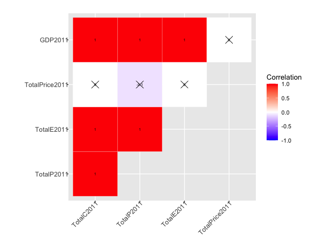<!-- -->

``` r
# Compute a correlation matrix
corr2012 <- round(cor(Consumption2012), 1)
# Compute a matrix of correlation p-values
p.mat2012 <- cor_pmat(Consumption2012)
# Visualize the correlation matrix
corrplot2012<-ggcorrplot(corr2012, type = "upper",
   outline.col = "white",
   #hc.order = TRUE,
   legend.title = "Correlation",
   p.mat = p.mat2012,
   lab = TRUE,
   lab_size = 2,
   ggtheme = ggplot2::theme_gray)+
  theme(
    axis.text.x=element_text(size=10, angle=45, vjust=1, hjust=1,margin=margin(-3,0,0,0)),
    axis.text.y=element_text(size=10, margin=margin(0,-3,0,0)),
    plot.margin=margin(t=20))
corrplot2012
```

<!-- -->

``` r
# Compute a correlation matrix
corr2013 <- round(cor(Consumption2013), 1)
# Compute a matrix of correlation p-values
p.mat2013 <- cor_pmat(Consumption2013)
# Visualize the correlation matrix
corrplot2013<-ggcorrplot(corr2013, type = "upper",
   outline.col = "white",
   #hc.order = TRUE,
   legend.title = "Correlation",
   p.mat = p.mat2013,
   lab = TRUE,
   lab_size = 2,
   ggtheme = ggplot2::theme_gray)+
  theme(
    axis.text.x=element_text(size=10, angle=45, vjust=1, hjust=1,margin=margin(-3,0,0,0)),
    axis.text.y=element_text(size=10, margin=margin(0,-3,0,0)),
    plot.margin=margin(t=20))
corrplot2013
```

<!-- -->

``` r
# Compute a correlation matrix
corr2014 <- round(cor(Consumption2014), 1)
# Compute a matrix of correlation p-values
p.mat2014 <- cor_pmat(Consumption2014)
# Visualize the correlation matrix
corrplot2014<-ggcorrplot(corr2014, type = "upper",
   outline.col = "white",
  # hc.order = TRUE,
   legend.title = "Correlation",
   p.mat = p.mat2014,
   lab = TRUE,
  lab_size = 2,
   ggtheme = ggplot2::theme_gray)+
  theme(
    axis.text.x=element_text(size=10, angle=45, vjust=1, hjust=1,margin=margin(-3,0,0,0)),
    axis.text.y=element_text(size=10, margin=margin(0,-3,0,0)),
    plot.margin=margin(t=20))
corrplot2014
```

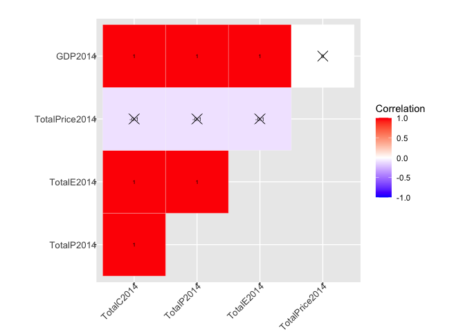<!-- -->

``` r
ggarrange( corrplot2011, corrplot2012,corrplot2013, corrplot2014,
            labels = c("Correlation 2011", "Correlation 2012", "Correlation 2013","Correlation 2014"),
            ncol = 2, nrow = 2,
            legend = "right",
           common.legend = TRUE)
```

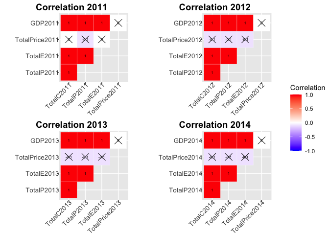<!-- -->
\# Consumption

``` r
#Generate an 2011 Consumption data table including all related columns
Consumption2011<-data%>%
  select("TotalC2011","BiomassC2011","CoalC2011","ElecC2011","FossFuelC2011","GeoC2011","HydroC2011","NatGasC2011","LPGC2011","GDP2011")
Consumption2011
```

    ## # A tibble: 52 × 10
    ##    TotalC2011 BiomassC2011 CoalC2011 ElecC2011 FossFuelC2011 GeoC2011 HydroC2011
    ##         <dbl>        <dbl>     <dbl>     <dbl>         <dbl>    <dbl>      <dbl>
    ##  1    1905207       179611    651032    303652       1783839      135      86313
    ##  2     653637         4247     15481     21562        635981      214      13066
    ##  3    1424944        28565    459909    255708       1253992      345      89135
    ##  4    1122544        97160    306119    163530        932878      750      28738
    ##  5    7777115       282581     55264    893745       5550201   124092     413488
    ##  6    1470445        30883    368871    182400       1304903      741      20235
    ##  7     739130        33958      6081    101879        557282       19       5513
    ##  8     272568         6781     17881     39181        201518      401          0
    ##  9    4141711       245557    552730    768009       3357837     9799       1769
    ## 10    2982837       210583    634756    465298       2142535      291      26282
    ## # … with 42 more rows, and 3 more variables: NatGasC2011 <dbl>, LPGC2011 <dbl>,
    ## #   GDP2011 <dbl>

``` r
#Generate an 2012 Consumption data table including all related columns
Consumption2012<-data%>%
  select("TotalC2012","BiomassC2012","CoalC2012","ElecC2012","FossFuelC2012","GeoC2012","HydroC2012","NatGasC2012","LPGC2012","GDP2012")
Consumption2012
```

    ## # A tibble: 52 × 10
    ##    TotalC2012 BiomassC2012 CoalC2012 ElecC2012 FossFuelC2012 GeoC2012 HydroC2012
    ##         <dbl>        <dbl>     <dbl>     <dbl>         <dbl>    <dbl>      <dbl>
    ##  1    1879716       181878    547004    294055       1740315      141      70754
    ##  2     649341         4032     15521     21893        629768      186      14988
    ##  3    1395839        27267    420570    256116       1248032      345      63918
    ##  4    1067642        96248    296732    159885        918078      808      20921
    ##  5    7564063       280963     43832    885544       5687343   121269     255384
    ##  6    1440781        30680    370085    183174       1282352      759      14247
    ##  7     725019        32800      9290    100628        544358       21       2970
    ##  8     273728         5972     17384     39304        221203      430          0
    ##  9    4029903       244646    482984    752941       3327632    10056       1432
    ## 10    2767491       207725    435546    446900       1946907      315      21281
    ## # … with 42 more rows, and 3 more variables: NatGasC2012 <dbl>, LPGC2012 <dbl>,
    ## #   GDP2012 <dbl>

``` r
#Generate an 2013 Consumption data table including all related columns
Consumption2013<-data%>%
  select("TotalC2013","BiomassC2013","CoalC2013","ElecC2013","FossFuelC2013","GeoC2013","HydroC2013","NatGasC2013","LPGC2013","GDP2013")
Consumption2013
```

    ## # A tibble: 52 × 10
    ##    TotalC2013 BiomassC2013 CoalC2013 ElecC2013 FossFuelC2013 GeoC2013 HydroC2013
    ##         <dbl>        <dbl>     <dbl>     <dbl>         <dbl>    <dbl>      <dbl>
    ##  1    1919365       194432    565051    299751       1689491      141     123071
    ##  2     621107         5168     14819     21387        600660      186      13696
    ##  3    1414383        26492    454865    258159       1289119      345      56432
    ##  4    1096438        95356    327099    159283        936796      808      25329
    ##  5    7665241       294412     38151    891666       5755210   119556     226643
    ##  6    1470844        35382    363532    182343       1303825      759      11572
    ##  7     754901        34153      7679    101761        560141       21       3835
    ##  8     273716         5977     18254     38719        213411      430          0
    ##  9    4076406       253961    505155    757189       3273949    10056       2425
    ## 10    2782782       233509    426184    445257       1928374      315      35431
    ## # … with 42 more rows, and 3 more variables: NatGasC2013 <dbl>, LPGC2013 <dbl>,
    ## #   GDP2013 <dbl>

``` r
#Generate an 2014 Consumption data table including all related columns
Consumption2014<-data%>%
 select("TotalC2014","BiomassC2014","CoalC2014","ElecC2014","FossFuelC2014","GeoC2014","HydroC2014","NatGasC2014","LPGC2014","GDP2014")
Consumption2014
```

    ## # A tibble: 52 × 10
    ##    TotalC2014 BiomassC2014 CoalC2014 ElecC2014 FossFuelC2014 GeoC2014 HydroC2014
    ##         <dbl>        <dbl>     <dbl>     <dbl>         <dbl>    <dbl>      <dbl>
    ##  1    1958221       186649    575912    308765       1724891      141      90030
    ##  2     603119         5476     18225     21034        581369      186      14633
    ##  3    1422590        31481    447849    260328       1256577      345      58185
    ##  4    1114409        95963    339214    160638        939788      808      25104
    ##  5    7620082       298473     39486    895939       5702418   117226     157213
    ##  6    1477177        36073    350526    182189       1313834      759      16831
    ##  7     750019        36011      9097    100157        559695       21       4127
    ##  8     274013         6249     10238     38687        213655      430          0
    ##  9    4121680       250043    557882    771379       3350291    10056       2010
    ## 10    2850990       252985    482657    463315       1985059      315      29142
    ## # … with 42 more rows, and 3 more variables: NatGasC2014 <dbl>, LPGC2014 <dbl>,
    ## #   GDP2014 <dbl>

``` r
#Visualization
#Consumption2011
# Compute a correlation matrix
corr2011 <- round(cor(Consumption2011), 1)
# Compute a matrix of correlation p-values
p.mat2011 <- cor_pmat(Consumption2011)
# Visualize the correlation matrix
corrplot2011<-ggcorrplot(corr2011, type = "upper",
   outline.col = "white",
   #hc.order = TRUE,
   legend.title = "Correlation",
   p.mat = p.mat2011,
   lab = TRUE,
   lab_size = 2,
   ggtheme = ggplot2::theme_gray)+
  theme(
    axis.text.x=element_text(size=10, angle=45, vjust=1, hjust=1,margin=margin(-3,0,0,0)),
    axis.text.y=element_text(size=10, margin=margin(0,-3,0,0)),
    plot.margin=margin(t=20))
corrplot2011
```

<!-- -->

``` r
# Compute a correlation matrix
corr2012 <- round(cor(Consumption2012), 1)
# Compute a matrix of correlation p-values
p.mat2012 <- cor_pmat(Consumption2012)
# Visualize the correlation matrix
corrplot2012<-ggcorrplot(corr2012, type = "upper",
   outline.col = "white",
   #hc.order = TRUE,
   legend.title = "Correlation",
   p.mat = p.mat2012,
   lab = TRUE,
   lab_size = 2,
   ggtheme = ggplot2::theme_gray)+
  theme(
    axis.text.x=element_text(size=10, angle=45, vjust=1, hjust=1,margin=margin(-3,0,0,0)),
    axis.text.y=element_text(size=10, margin=margin(0,-3,0,0)),
    plot.margin=margin(t=20))
corrplot2012
```

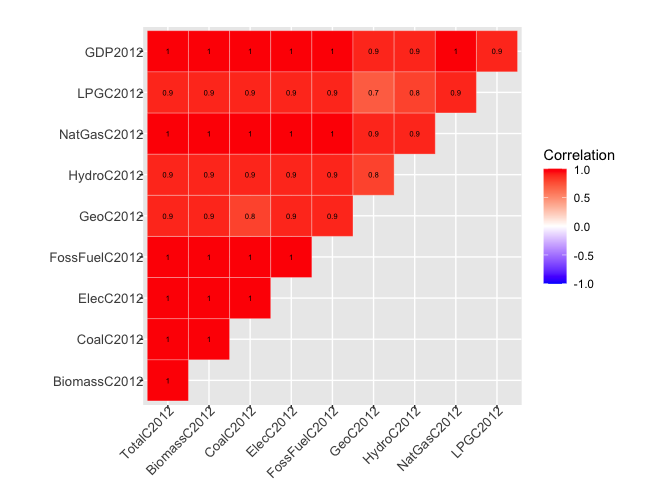<!-- -->

``` r
# Compute a correlation matrix
corr2013 <- round(cor(Consumption2013), 1)
# Compute a matrix of correlation p-values
p.mat2013 <- cor_pmat(Consumption2013)
# Visualize the correlation matrix
corrplot2013<-ggcorrplot(corr2013, type = "upper",
   outline.col = "white",
   #hc.order = TRUE,
   legend.title = "Correlation",
   p.mat = p.mat2013,
   lab = TRUE,
   lab_size = 2,
   ggtheme = ggplot2::theme_gray)+
  theme(
    axis.text.x=element_text(size=10, angle=45, vjust=1, hjust=1,margin=margin(-3,0,0,0)),
    axis.text.y=element_text(size=10, margin=margin(0,-3,0,0)),
    plot.margin=margin(t=20))
corrplot2013
```

<!-- -->

``` r
# Compute a correlation matrix
corr2014 <- round(cor(Consumption2014), 1)
# Compute a matrix of correlation p-values
p.mat2014 <- cor_pmat(Consumption2014)
# Visualize the correlation matrix
corrplot2014<-ggcorrplot(corr2014, type = "upper",
   outline.col = "white",
  # hc.order = TRUE,
   legend.title = "Correlation",
   p.mat = p.mat2014,
   lab = TRUE,
  lab_size = 2,
   ggtheme = ggplot2::theme_gray)+
  theme(
    axis.text.x=element_text(size=10, angle=45, vjust=1, hjust=1,margin=margin(-3,0,0,0)),
    axis.text.y=element_text(size=10, margin=margin(0,-3,0,0)),
    plot.margin=margin(t=20))
corrplot2014
```

<!-- -->

``` r
ggarrange( corrplot2011, corrplot2012,corrplot2013, corrplot2014,
            labels = c("Correlation 2011", "Correlation 2012", "Correlation 2013","Correlation 2014"),
            ncol = 2, nrow = 2,
            legend = "right",
           common.legend = TRUE)
```

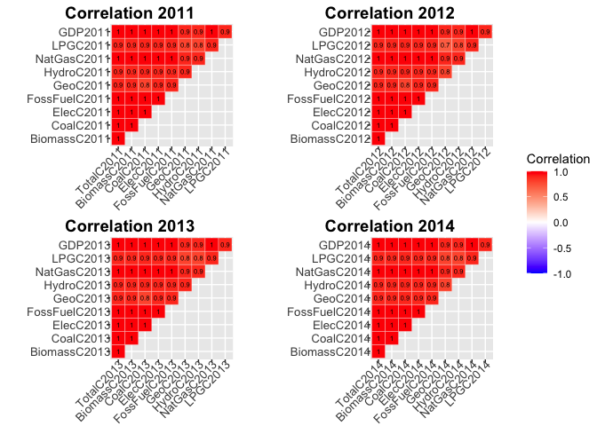<!-- -->

``` r
head(data)
```

    ## # A tibble: 6 × 288
    ##   StateCodes State      Region Division Coast `Great Lakes` TotalC2010 TotalC2011
    ##   <chr>      <chr>       <dbl>    <dbl> <dbl>         <dbl>      <dbl>      <dbl>
    ## 1 AL         Alabama         3        6     1             0    1931522    1905207
    ## 2 AK         Alaska          4        9     1             0     653221     653637
    ## 3 AZ         Arizona         4        8     0             0    1383531    1424944
    ## 4 AR         Arkansas        3        7     0             0    1120632    1122544
    ## 5 CA         California      4        9     1             0    7760629    7777115
    ## 6 CO         Colorado        4        8     0             0    1513547    1470445
    ## # … with 280 more variables: TotalC2012 <dbl>, TotalC2013 <dbl>,
    ## #   TotalC2014 <dbl>, TotalP2010 <dbl>, TotalP2011 <dbl>, TotalP2012 <dbl>,
    ## #   TotalP2013 <dbl>, TotalP2014 <dbl>, TotalE2010 <dbl>, TotalE2011 <dbl>,
    ## #   TotalE2012 <dbl>, TotalE2013 <dbl>, TotalE2014 <dbl>, TotalPrice2010 <dbl>,
    ## #   TotalPrice2011 <dbl>, TotalPrice2012 <dbl>, TotalPrice2013 <dbl>,
    ## #   TotalPrice2014 <dbl>, TotalC10-11 <dbl>, TotalC11-12 <dbl>,
    ## #   TotalC12-13 <dbl>, TotalC13-14 <dbl>, TotalP10-11 <dbl>, …

# Production

``` r
#Generate an 2011 Production data table including all related columns
Production2011<-data%>%
  select("TotalP2011","CoalP2011","GeoP2011","HydroP2011","GDP2011")
Production2011
```

    ## # A tibble: 52 × 5
    ##    TotalP2011 CoalP2011 GeoP2011 HydroP2011  GDP2011
    ##         <dbl>     <dbl>    <dbl>      <dbl>    <dbl>
    ##  1    1400108    468671        0       8884  181923 
    ##  2    1641980     33524        0       1345   59318.
    ##  3     617956    174841        0       9174  255620.
    ##  4    1391190      2985        0       2958  109378.
    ##  5    2634789         0    12552      42557 2031348.
    ##  6    2750097    586847        0       2083  266796.
    ##  7     195792         0        0        567  232271.
    ##  8       3976         0        0          0   59763.
    ##  9     500907         0        0        182  735244.
    ## 10     549483         0        0       2705  418916.
    ## # … with 42 more rows

``` r
#Generate an 2012 Production data table including all related columns
Production2012<-data%>%
  select("TotalP2012","CoalP2012","GeoP2012","HydroP2012","GDP2012")
Production2012
```

    ## # A tibble: 52 × 5
    ##    TotalP2012 CoalP2012 GeoP2012 HydroP2012  GDP2012
    ##         <dbl>     <dbl>    <dbl>      <dbl>    <dbl>
    ##  1    1433370    488084        0       7435  187283.
    ##  2    1563102     31332        0       1575   61614.
    ##  3     598039    161374        0       6717  266131.
    ##  4    1472778      2077        0       2198  111541 
    ##  5    2334863         0    12519      26837 2121602.
    ##  6    2921385    629645        0       1497  277647.
    ##  7     205073         0        0        312  238322.
    ##  8       3530         0        0          0   60774.
    ##  9     442188         0        0        151  764646.
    ## 10     555238         0        0       2236  434978.
    ## # … with 42 more rows

``` r
#Generate an 2013 Production data table including all related columns
Production2013<-data%>%
  select("TotalP2013","CoalP2013","GeoP2013","HydroP2013","GDP2013")
Production2013
```

    ## # A tibble: 52 × 5
    ##    TotalP2013 CoalP2013 GeoP2013 HydroP2013  GDP2013
    ##         <dbl>     <dbl>    <dbl>      <dbl>    <dbl>
    ##  1    1463647    469162        0      12899  191605.
    ##  2    1513859     24917        0       1435   59891.
    ##  3     594994    163691        0       5915  271072.
    ##  4    1432074      1433        0       2655  116652.
    ##  5    2390424         0    12307      23755 2215232.
    ##  6    2838193    529096        0       1213  288809 
    ##  7     207118         0        0        402  242417 
    ##  8       3818         0        0          0   61424.
    ##  9     542570         0        0        254  797344.
    ## 10     581082         0        0       3714  450934.
    ## # … with 42 more rows

``` r
#Generate an 2014 Production data table including all related columns
Production2014<-data%>%
  select("TotalP2014","CoalP2014","GeoP2014","HydroP2014","GDP2014")
Production2014
```

    ## # A tibble: 52 × 5
    ##    TotalP2014 CoalP2014 GeoP2014 HydroP2014  GDP2014
    ##         <dbl>     <dbl>    <dbl>      <dbl>    <dbl>
    ##  1    1353725    414366        0       9467  197534.
    ##  2    1475129     22944        0       1539   58067.
    ##  3     635050    173337        0       6118  281559.
    ##  4    1454325      1864        0       2640  121065.
    ##  5    2413494         0    12102      16531 2324996.
    ##  6    3041634    528242        0       1770  305367.
    ##  7     197271         0        0        434  250764.
    ##  8       4189         0        0          0   65485.
    ##  9     553738         0        0        211  835578.
    ## 10     597955         0        0       3064  471880.
    ## # … with 42 more rows

``` r
#Visualization

#Production2011
# Compute a correlation matrix
corr2011 <- round(cor(Production2011), 1)
# Compute a matrix of correlation p-values
p.mat2011 <- cor_pmat(Production2011)
# Visualize the correlation matrix
corrplot2011<-ggcorrplot(corr2011, type = "upper",
   outline.col = "white",
   hc.order = TRUE,
   p.mat = p.mat2011,
   legend.title = "Correlation",
   lab = TRUE,
   lab_size = 2,
   ggtheme = ggplot2::theme_gray)+
  theme(
    axis.text.x=element_text(size=10, angle=45, vjust=1, hjust=1,margin=margin(-3,0,0,0)),
    axis.text.y=element_text(size=10, margin=margin(0,-3,0,0)),
    plot.margin=margin(t=20))
corrplot2011
```

<!-- -->

``` r
# Compute a correlation matrix
corr2012 <- round(cor(Production2012), 1)
# Compute a matrix of correlation p-values
p.mat2012 <- cor_pmat(Production2012)
# Visualize the correlation matrix
corrplot2012<-ggcorrplot(corr2012, type = "upper",
   outline.col = "white",
   hc.order = TRUE,
   p.mat = p.mat2012,
   legend.title = "Correlation",
   lab = TRUE,
   lab_size = 2,
   ggtheme = ggplot2::theme_gray)+
  theme(
    axis.text.x=element_text(size=10, angle=45, vjust=1, hjust=1,margin=margin(-3,0,0,0)),
    axis.text.y=element_text(size=10, margin=margin(0,-3,0,0)),
    plot.margin=margin(t=20))
corrplot2012
```

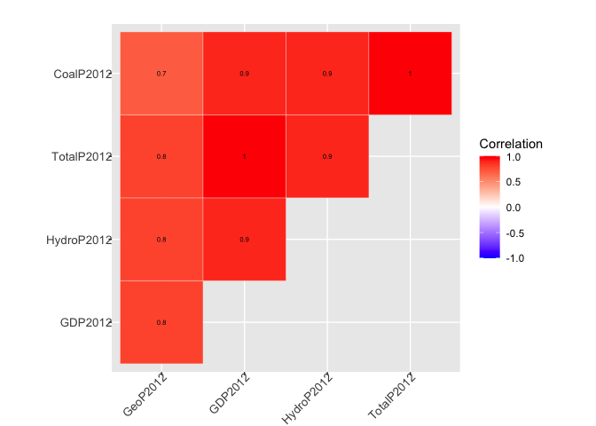<!-- -->

``` r
# Compute a correlation matrix
corr2013 <- round(cor(Production2013), 1)
# Compute a matrix of correlation p-values
p.mat2013 <- cor_pmat(Production2013)
# Visualize the correlation matrix
corrplot2013<-ggcorrplot(corr2013, type = "upper",
   outline.col = "white",
   hc.order = TRUE,
   p.mat = p.mat2013,
   legend.title = "Correlation",
   lab = TRUE,
   lab_size = 2,
   ggtheme = ggplot2::theme_gray)+
  theme(
    axis.text.x=element_text(size=10, angle=45, vjust=1, hjust=1,margin=margin(-3,0,0,0)),
    axis.text.y=element_text(size=10, margin=margin(0,-3,0,0)),
    plot.margin=margin(t=20))
corrplot2013
```

<!-- -->

``` r
# Compute a correlation matrix
corr2014 <- round(cor(Production2014), 1)
# Compute a matrix of correlation p-values
p.mat2014 <- cor_pmat(Production2014)
# Visualize the correlation matrix
corrplot2014<-ggcorrplot(corr2014, type = "upper",
   outline.col = "white",
   hc.order = TRUE,
   p.mat = p.mat2014,
   legend.title = "Correlation",
   lab = TRUE,
   lab_size = 2,
   ggtheme = ggplot2::theme_gray)+
  theme(
    axis.text.x=element_text(size=10, angle=45, vjust=1, hjust=1,margin=margin(-3,0,0,0)),
    axis.text.y=element_text(size=10, margin=margin(0,-3,0,0)),
    plot.margin=margin(t=20))
corrplot2014
```

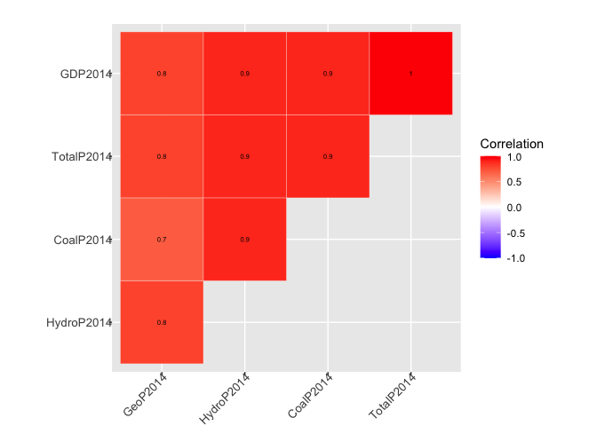<!-- -->

``` r
ggarrange( corrplot2011, corrplot2012,corrplot2013, corrplot2014,
            labels = c("Correlation 2011", "Correlation 2012", "Correlation 2013","Correlation 2014"),
            ncol = 2, nrow = 2,
            legend = "right")
```

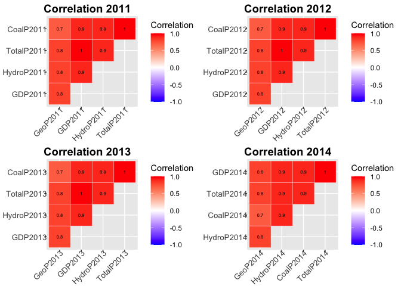<!-- -->

# Expenditures

``` r
#Generate an 2011 Expenditures data table including all related columns
Expenditures2011<-data%>%
  select("TotalE2011","CoalE2011","ElecE2011","NatGasE2011","LPGE2011","GDP2011")
Expenditures2011
```

    ## # A tibble: 52 × 6
    ##    TotalE2011 CoalE2011 ElecE2011 NatGasE2011 LPGE2011  GDP2011
    ##         <dbl>     <dbl>     <dbl>       <dbl>    <dbl>    <dbl>
    ##  1     24448.    2010.      7846.       3123.    274.   181923 
    ##  2      8050.      59.6     1005.        545.     36.9   59318.
    ##  3     22629.     917.      7279.       2084.    280.   255620.
    ##  4     14179.     592.      3447.       1903.    240.   109378.
    ##  5    135098.     173.     33919.      14354.   1921   2031348.
    ##  6     19270.     637       4963.       2334.    412.   266796.
    ##  7     15498.      22.4     4882.       1789.    323.   232271.
    ##  8      3988.      61       1309.        708.    143.    59763.
    ##  9     67345.    1960.     23880.       7701.    605.   735244.
    ## 10     42316.    2400.     13108.       4165.    503.   418916.
    ## # … with 42 more rows

``` r
#Generate an 2012 Expenditures data table including all related columns
Expenditures2012<-data%>%
  select("TotalE2012","CoalE2012","ElecE2012","NatGasE2012","LPGE2012","GDP2012")
Expenditures2012
```

    ## # A tibble: 52 × 6
    ##    TotalE2012 CoalE2012 ElecE2012 NatGasE2012 LPGE2012  GDP2012
    ##         <dbl>     <dbl>     <dbl>       <dbl>    <dbl>    <dbl>
    ##  1     24193.    1809.      7666.       2596.     212   187283.
    ##  2      7884.      63       1035         514.      36    61614.
    ##  3     22872.     880.      7361        1802.     188.  266131.
    ##  4     13756.     673.      3456.       1496.     191   111541 
    ##  5    135932      134.     34852.      13010.    1492. 2121602.
    ##  6     19296.     689.      4988.       2065.     332.  277647.
    ##  7     15127.      33.3     4584.       1631.     281.  238322.
    ##  8      4040.      58.3     1266.        748.     130.   60774.
    ##  9     66380     1698.     23029.       6982.     466.  764646.
    ## 10     39837.    1530.     12275.       3830.     527.  434978.
    ## # … with 42 more rows

``` r
#Generate an 2013 Expenditures data table including all related columns
Expenditures2013<-data%>%
  select("TotalE2013","CoalE2013","ElecE2013","NatGasE2013","LPGE2013","GDP2013")
Expenditures2013
```

    ## # A tibble: 52 × 6
    ##    TotalE2013 CoalE2013 ElecE2013 NatGasE2013 LPGE2013  GDP2013
    ##         <dbl>     <dbl>     <dbl>       <dbl>    <dbl>    <dbl>
    ##  1     24127     1732.      7901.       3091.    222.   191605.
    ##  2      7282.      72.6     1005.        495.     33.2   59891.
    ##  3     22841.     947.      7669.       2026.    223.   271072.
    ##  4     14102.     789.      3687.       1679     218.   116652.
    ##  5    137051.     130.     37028.      14809.   1493.  2215232.
    ##  6     19671.     703.      5258.       2355.    424.   288809 
    ##  7     15364.      32.3     4669.       1922.    331.   242417 
    ##  8      3857.      58.4     1216.        702.    140.    61424.
    ##  9     66108.    1736.     22678.       6853.    448.   797344.
    ## 10     39938.    1372.     12648.       4418.    434.   450934.
    ## # … with 42 more rows

``` r
#Generate an 2014 Expenditures data table including all related columns
Expenditures2014<-data%>%
  select("TotalE2014","CoalE2014","ElecE2014","NatGasE2014","LPGE2014","GDP2014")
Expenditures2014
```

    ## # A tibble: 52 × 6
    ##    TotalE2014 CoalE2014 ElecE2014 NatGasE2014 LPGE2014  GDP2014
    ##         <dbl>     <dbl>     <dbl>       <dbl>    <dbl>    <dbl>
    ##  1     24146.    1677.      8363.       3521.    227.   197534.
    ##  2      6891.      88.8     1056.        481.     32.9   58067.
    ##  3     22610.     945.      7764.       2156.    223.   281559.
    ##  4     13885.     821.      3704.       1849.    236.   121065.
    ##  5    137720.     135.     39424.      16128.   1425.  2324996.
    ##  6     19994.     684.      5346.       2686.    419    305367.
    ##  7     15483.      38.8     5004        2162     330.   250764.
    ##  8      3848.      31.5     1239.        753.    154.    65485.
    ##  9     66414.    1858.     24339.       7468     481.   835578.
    ## 10     39728.    1521.     13614.       4963.    518.   471880.
    ## # … with 42 more rows

``` r
#Visualization

#Expenditures2011
# Compute a correlation matrix
corr2011 <- round(cor(Expenditures2011), 1)
# Compute a matrix of correlation p-values
p.mat2011 <- cor_pmat(Expenditures2011)
# Visualize the correlation matrix
corrplot2011<-ggcorrplot(corr2011, type = "upper",
   outline.col = "white",
   p.mat = p.mat2011,
   legend.title = "Correlation",
   lab = TRUE,
   lab_size = 2,
   ggtheme = ggplot2::theme_gray)+
  theme(
    axis.text.x=element_text(size=10, angle=45, vjust=1, hjust=1,margin=margin(-3,0,0,0)),
    axis.text.y=element_text(size=10, margin=margin(0,-3,0,0)),
    plot.margin=margin(t=20))
corrplot2011
```

<!-- -->

``` r
# Compute a correlation matrix
corr2012 <- round(cor(Expenditures2012), 1)
# Compute a matrix of correlation p-values
p.mat2012 <- cor_pmat(Expenditures2012)
# Visualize the correlation matrix
corrplot2012<-ggcorrplot(corr2012, type = "upper",
   outline.col = "white",
   p.mat = p.mat2012,
   legend.title = "Correlation",
   lab = TRUE,
   lab_size = 2,
   ggtheme = ggplot2::theme_gray)+
  theme(
    axis.text.x=element_text(size=10, angle=45, vjust=1, hjust=1,margin=margin(-3,0,0,0)),
    axis.text.y=element_text(size=10, margin=margin(0,-3,0,0)),
    plot.margin=margin(t=20))
corrplot2012
```

<!-- -->

``` r
# Compute a correlation matrix
corr2013 <- round(cor(Expenditures2013), 1)
# Compute a matrix of correlation p-values
p.mat2013 <- cor_pmat(Expenditures2013)
# Visualize the correlation matrix
corrplot2013<-ggcorrplot(corr2013, type = "upper",
   outline.col = "white",
   p.mat = p.mat2013,
   legend.title = "Correlation",
   lab = TRUE,
   lab_size = 2,
   ggtheme = ggplot2::theme_gray)+
  theme(
    axis.text.x=element_text(size=10, angle=45, vjust=1, hjust=1,margin=margin(-3,0,0,0)),
    axis.text.y=element_text(size=10, margin=margin(0,-3,0,0)),
    plot.margin=margin(t=20))
corrplot2013
```

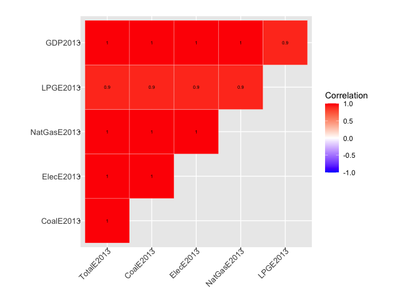<!-- -->

``` r
# Compute a correlation matrix
corr2014 <- round(cor(Expenditures2014), 1)
# Compute a matrix of correlation p-values
p.mat2014 <- cor_pmat(Expenditures2014)
# Visualize the correlation matrix
corrplot2014<-ggcorrplot(corr2014, type = "upper",
   outline.col = "white",
   p.mat = p.mat2014,
   legend.title = "Correlation",
   lab = TRUE,
   lab_size = 2,
   ggtheme = ggplot2::theme_gray)+
  theme(
    axis.text.x=element_text(size=10, angle=45, vjust=1, hjust=1,margin=margin(-3,0,0,0)),
    axis.text.y=element_text(size=10, margin=margin(0,-3,0,0)),
    plot.margin=margin(t=20))
corrplot2014
```

<!-- -->

``` r
ggarrange( corrplot2011, corrplot2012,corrplot2013, corrplot2014,
            labels = c("Correlation 2011", "Correlation 2012", "Correlation 2013","Correlation 2014"),
            ncol = 2, nrow = 2,
            legend = "right",common.legend = TRUE)
```

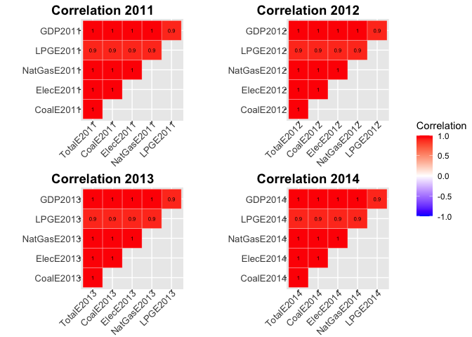<!-- -->

# Price

``` r
#Generate an 2011 Price data table including all related columns
Price2011<-data%>%
  select("TotalPrice2011","CoalPrice2011","ElecPrice2011","NatGasPrice2011","LPGPrice2011","GDP2011")
Price2011
```

    ## # A tibble: 52 × 6
    ##    TotalPrice2011 CoalPrice2011 ElecPrice2011 NatGasPrice2011 LPGPrice2011
    ##             <dbl>         <dbl>         <dbl>           <dbl>        <dbl>
    ##  1           20.1          3.09          27.1            5.72         26.5
    ##  2           24.9          3.85          47.1            6.61         29.8
    ##  3           25.6          1.99          28.5            7.45         32.0
    ##  4           19.7          1.93          22.0            7.36         26.7
    ##  5           24.4          3.13          38.4            7.08         31.3
    ##  6           21.3          1.73          27.6            6.79         25.8
    ##  7           28.1          3.68          47.9            7.79         32.0
    ##  8           25.3          3.41          33.7            8.92         30.3
    ##  9           25.4          3.55          31.1            6.33         31.5
    ## 10           21.5          3.78          28.2            7.98         27.0
    ## # … with 42 more rows, and 1 more variable: GDP2011 <dbl>

``` r
#Generate an 2012 Price data table including all related columns
Price2012<-data%>%
  select("TotalPrice2012","CoalPrice2012","ElecPrice2012","NatGasPrice2012","LPGPrice2012","GDP2012")
Price2012
```

    ## # A tibble: 52 × 6
    ##    TotalPrice2012 CoalPrice2012 ElecPrice2012 NatGasPrice2012 LPGPrice2012
    ##             <dbl>         <dbl>         <dbl>           <dbl>        <dbl>
    ##  1           20.0          3.31          27.3            4.28         24.6
    ##  2           25.1          4.06          47.8            6.26         27.5
    ##  3           26.4          2.09          28.7            5.52         28.9
    ##  4           20.0          2.27          22.6            5.53         24.7
    ##  5           25.0          3.05          39.8            5.72         27.7
    ##  6           21.8          1.86          27.6            6.32         22.1
    ##  7           28.7          3.59          45.6            7.05         31.3
    ##  8           24.8          3.35          32.5            7.43         30.2
    ##  9           25.6          3.51          30.6            5.27         26.6
    ## 10           21.7          3.51          27.5            6.23         25.7
    ## # … with 42 more rows, and 1 more variable: GDP2012 <dbl>

``` r
#Generate an 2013 Price data table including all related columns
Price2013<-data%>%
  select("TotalPrice2013","CoalPrice2013","ElecPrice2013","NatGasPrice2013","LPGPrice2013","GDP2013")
Price2013
```

    ## # A tibble: 52 × 6
    ##    TotalPrice2013 CoalPrice2013 ElecPrice2013 NatGasPrice2013 LPGPrice2013
    ##             <dbl>         <dbl>         <dbl>           <dbl>        <dbl>
    ##  1           19.0          3.06          26.5            5.38         24.4
    ##  2           24.6          4.9           48.4            6.78         26.1
    ##  3           26.0          2.08          29.7            6.19         29.5
    ##  4           19.5          2.41          23.3            6.44         24.6
    ##  5           24.8          3.39          42.0            6.51         27.9
    ##  6           21.1          1.93          29.0            6.35         23.8
    ##  7           27.7          4.21          45.9            8.11         30.2
    ##  8           24.3          3.2           32.1            7.86         29.8
    ##  9           25.1          3.44          30.0            5.59         26.7
    ## 10           21.4          3.22          28.4            7.06         24.9
    ## # … with 42 more rows, and 1 more variable: GDP2013 <dbl>

``` r
#Generate an 2014 Price data table including all related columns
Price2014<-data%>%
  select("TotalPrice2014","CoalPrice2014","ElecPrice2014","NatGasPrice2014","LPGPrice2014","GDP2014")
Price2014
```

    ## # A tibble: 52 × 6
    ##    TotalPrice2014 CoalPrice2014 ElecPrice2014 NatGasPrice2014 LPGPrice2014
    ##             <dbl>         <dbl>         <dbl>           <dbl>        <dbl>
    ##  1           18.6          2.91          27.2            5.81         26.8
    ##  2           24.4          4.87          51.3            6.99         27.6
    ##  3           25.9          2.11          29.8            7.15         30.3
    ##  4           18.9          2.42          23.2            7.44         25.8
    ##  5           25.3          3.43          44.5            7.39         28.4
    ##  6           21.2          1.95          29.5            7.13         25.8
    ##  7           27.8          4.27          50.0            9.17         32.7
    ##  8           23.8          3.08          33.2            7.83         31.7
    ##  9           24.9          3.33          31.6            6.04         29.2
    ## 10           21.0          3.15          29.4            7.52         27.1
    ## # … with 42 more rows, and 1 more variable: GDP2014 <dbl>

``` r
#Visualization


#Price2011
# Compute a correlation matrix
corr2011 <- round(cor(Price2011), 1)
# Compute a matrix of correlation p-values
p.mat2011 <- cor_pmat(Price2011)
# Visualize the correlation matrix
corrplot2011<-ggcorrplot(corr2011, type = "upper",
   outline.col = "white",
   hc.order = TRUE,
   p.mat = p.mat2011,
   legend.title = "Correlation",
   lab = TRUE,
   ggtheme = ggplot2::theme_gray)+
  theme(
    axis.text.x=element_text(size=10, angle=45, vjust=1, hjust=1,margin=margin(-3,0,0,0)),
    axis.text.y=element_text(size=10, margin=margin(0,-3,0,0)),
    plot.margin=margin(t=20))
corrplot2011
```

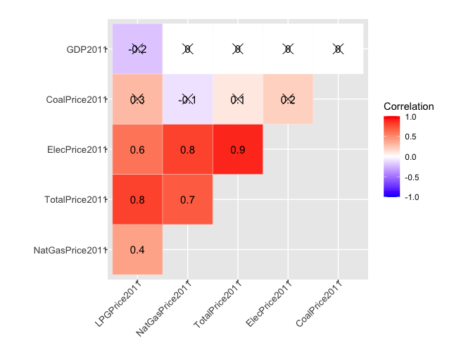<!-- -->

``` r
# Compute a correlation matrix
corr2012 <- round(cor(Price2012), 1)
# Compute a matrix of correlation p-values
p.mat2012 <- cor_pmat(Price2012)
# Visualize the correlation matrix
corrplot2012<-ggcorrplot(corr2012, type = "upper",
   outline.col = "white",
   hc.order = TRUE,
   p.mat = p.mat2012,
   legend.title = "Correlation",
   lab = TRUE,
   ggtheme = ggplot2::theme_gray)+
  theme(
    axis.text.x=element_text(size=10, angle=45, vjust=1, hjust=1,margin=margin(-3,0,0,0)),
    axis.text.y=element_text(size=10, margin=margin(0,-3,0,0)),
    plot.margin=margin(t=20))
corrplot2012
```

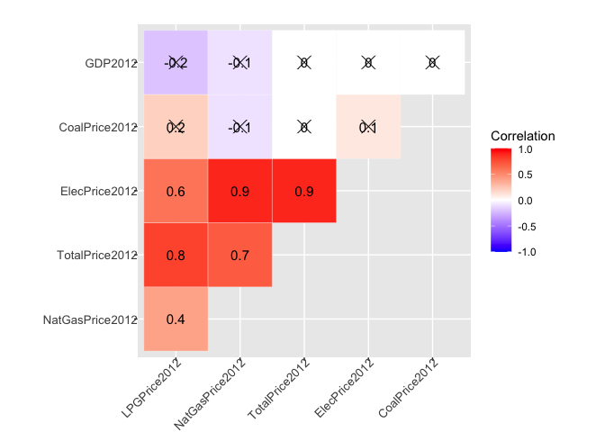<!-- -->

``` r
# Compute a correlation matrix
corr2013 <- round(cor(Price2013), 1)
# Compute a matrix of correlation p-values
p.mat2013 <- cor_pmat(Price2013)
# Visualize the correlation matrix
corrplot2013<-ggcorrplot(corr2013, type = "upper",
   outline.col = "white",
   hc.order = TRUE,
   p.mat = p.mat2013,
   legend.title = "Correlation",
   lab = TRUE,
   ggtheme = ggplot2::theme_gray)+
  theme(
    axis.text.x=element_text(size=10, angle=45, vjust=1, hjust=1,margin=margin(-3,0,0,0)),
    axis.text.y=element_text(size=10, margin=margin(0,-3,0,0)),
    plot.margin=margin(t=20))
corrplot2013
```

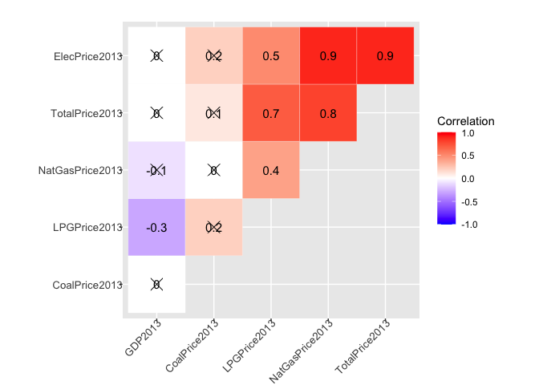<!-- -->

``` r
# Compute a correlation matrix
corr2014 <- round(cor(Price2014), 1)
# Compute a matrix of correlation p-values
p.mat2014 <- cor_pmat(Price2014)
# Visualize the correlation matrix
corrplot2014<-ggcorrplot(corr2014, type = "upper",
   outline.col = "white",
   hc.order = TRUE,
   p.mat = p.mat2014,
   legend.title = "Correlation",
   lab = TRUE,
   ggtheme = ggplot2::theme_gray)+
  theme(
    axis.text.x=element_text(size=10, angle=45, vjust=1, hjust=1,margin=margin(-3,0,0,0)),
    axis.text.y=element_text(size=10, margin=margin(0,-3,0,0)),
    plot.margin=margin(t=20))
corrplot2014
```

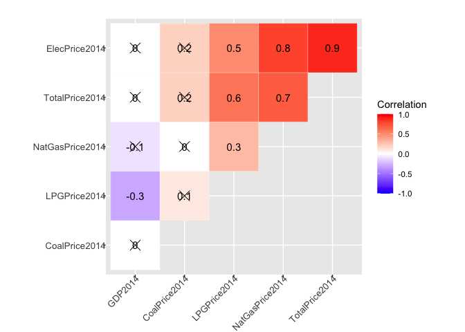<!-- -->

``` r
ggarrange( corrplot2011, corrplot2012,corrplot2013, corrplot2014,
            labels = c("Correlation 2011", "Correlation 2012", "Correlation 2013","Correlation 2014"),
            ncol = 2, nrow = 2,
            legend = "right",common.legend = TRUE)
```

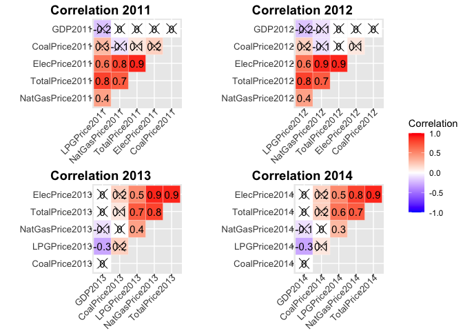<!-- -->
