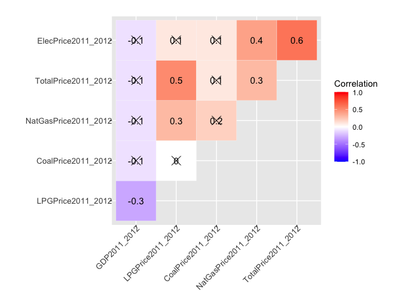

Eda\_Final\_cor\_Peter
================
Zhengqi Tian
11/18/2021

``` r
library(ggdemetra)
```

    ## Loading required package: ggplot2

``` r
library(tidyverse)
```

    ## ── Attaching packages ─────────────────────────────────────── tidyverse 1.3.1 ──

    ## ✓ tibble  3.1.4     ✓ dplyr   1.0.7
    ## ✓ tidyr   1.1.3     ✓ stringr 1.4.0
    ## ✓ readr   2.0.1     ✓ forcats 0.5.1
    ## ✓ purrr   0.3.4

    ## ── Conflicts ────────────────────────────────────────── tidyverse_conflicts() ──
    ## x dplyr::filter() masks stats::filter()
    ## x dplyr::lag()    masks stats::lag()

``` r
library(ggplot2)
library(ggpubr)
library(ggcorrplot)
```

``` r
data <- read_csv("Energy Census and Economic Data US 2010-2014 copy.csv")
```

    ## Rows: 52 Columns: 192

    ## ── Column specification ────────────────────────────────────────────────────────
    ## Delimiter: ","
    ## chr   (2): StateCodes, State
    ## dbl (190): Region, Division, Coast, Great Lakes, TotalC2010, TotalC2011, Tot...

    ## 
    ## ℹ Use `spec()` to retrieve the full column specification for this data.
    ## ℹ Specify the column types or set `show_col_types = FALSE` to quiet this message.

``` r
head(data)
```

    ## # A tibble: 6 × 192
    ##   StateCodes State      Region Division Coast `Great Lakes` TotalC2010 TotalC2011
    ##   <chr>      <chr>       <dbl>    <dbl> <dbl>         <dbl>      <dbl>      <dbl>
    ## 1 AL         Alabama         3        6     1             0    1931522    1905207
    ## 2 AK         Alaska          4        9     1             0     653221     653637
    ## 3 AZ         Arizona         4        8     0             0    1383531    1424944
    ## 4 AR         Arkansas        3        7     0             0    1120632    1122544
    ## 5 CA         California      4        9     1             0    7760629    7777115
    ## 6 CO         Colorado        4        8     0             0    1513547    1470445
    ## # … with 184 more variables: TotalC2012 <dbl>, TotalC2013 <dbl>,
    ## #   TotalC2014 <dbl>, TotalP2010 <dbl>, TotalP2011 <dbl>, TotalP2012 <dbl>,
    ## #   TotalP2013 <dbl>, TotalP2014 <dbl>, TotalE2010 <dbl>, TotalE2011 <dbl>,
    ## #   TotalE2012 <dbl>, TotalE2013 <dbl>, TotalE2014 <dbl>, TotalPrice2010 <dbl>,
    ## #   TotalPrice2011 <dbl>, TotalPrice2012 <dbl>, TotalPrice2013 <dbl>,
    ## #   TotalPrice2014 <dbl>, TotalC10-11 <dbl>, TotalC11-12 <dbl>,
    ## #   TotalC12-13 <dbl>, TotalC13-14 <dbl>, TotalP10-11 <dbl>, …

``` r
data<- data[1:52,]%>%
   mutate(GDP2010_2011 = GDP2011-GDP2010,
          GDP2011_2012 = GDP2012-GDP2011,
          GDP2012_2013 = GDP2013-GDP2012,
          GDP2013_2014 = GDP2014-GDP2013,
          NatGasC2010_2011=NatGasC2011-NatGasC2010,
          NatGasC2011_2012=NatGasC2012-NatGasC2011,
          NatGasC2012_2013=NatGasC2013-NatGasC2012,
          NatGasC2013_2014=NatGasC2014-NatGasC2013,
          TotalC2010_2011=TotalC2011-TotalC2010,
          TotalC2011_2012=TotalC2012-TotalC2011,
          TotalC2012_2013=TotalC2013-TotalC2012,
          TotalC2013_2014=TotalC2014-TotalC2013,
          CoalC2010_2011=CoalC2011-CoalC2010,
          CoalC2011_2012=CoalC2012-CoalC2011,
          CoalC2012_2013=CoalC2013-CoalC2012,
          CoalC2013_2014=CoalC2014-CoalC2013,
          GeoC2010_2011=GeoC2011-GeoC2010,
          GeoC2011_2012=GeoC2012-GeoC2011,
          GeoC2012_2013=GeoC2013-GeoC2012,
          GeoC2013_2014=GeoC2014-GeoC2013,
          ElecC2010_2011=ElecC2011-ElecC2010,
          ElecC2011_2012=ElecC2012-ElecC2011,
          ElecC2012_2013=ElecC2013-ElecC2012,
          ElecC2013_2014=ElecC2014-ElecC2013,
          LPGC2010_2011=LPGC2011-LPGC2010,
          LPGC2011_2012=LPGC2012-LPGC2011,
          LPGC2012_2013=LPGC2013-LPGC2012,
          LPGC2013_2014=LPGC2014-LPGC2013,
          HydroC2010_2011=HydroC2011-HydroC2010,
          HydroC2011_2012=HydroC2012-HydroC2011,
          HydroC2012_2013=HydroC2013-HydroC2012,
          HydroC2013_2014=HydroC2014-HydroC2013,
          FossFuelC2010_2011=FossFuelC2011-FossFuelC2010,
          FossFuelC2011_2012=FossFuelC2012-FossFuelC2011,
          FossFuelC2012_2013=FossFuelC2013-FossFuelC2012,
          FossFuelC2013_2014=FossFuelC2014-FossFuelC2013,
          BiomassC2010_2011=BiomassC2011-BiomassC2010,
          BiomassC2011_2012=BiomassC2012-BiomassC2011,
          BiomassC2012_2013=BiomassC2013-BiomassC2012,
          BiomassC2013_2014=BiomassC2014-BiomassC2013,
          NatGasPrice2010_2011=NatGasPrice2011-NatGasPrice2010,
          NatGasPrice2011_2012=NatGasPrice2012-NatGasPrice2011,
          NatGasPrice2012_2013=NatGasPrice2013-NatGasPrice2012,
          NatGasPrice2013_2014=NatGasPrice2014-NatGasPrice2013,
          TotalPrice2010_2011=TotalPrice2011-TotalPrice2010,
          TotalPrice2011_2012=TotalPrice2012-TotalPrice2011,
          TotalPrice2012_2013=TotalPrice2013-TotalPrice2012,
          TotalPrice2013_2014=TotalPrice2014-TotalPrice2013,
          CoalPrice2010_2011=CoalPrice2011-CoalPrice2010,
          CoalPrice2011_2012=CoalPrice2012-CoalPrice2011,
          CoalPrice2012_2013=CoalPrice2013-CoalPrice2012,
          CoalPrice2013_2014=CoalPrice2014-CoalPrice2013,
          ElecPrice2010_2011=ElecPrice2011-ElecPrice2010,
          ElecPrice2011_2012=ElecPrice2012-ElecPrice2011,
          ElecPrice2012_2013=ElecPrice2013-ElecPrice2012,
          ElecPrice2013_2014=ElecPrice2014-ElecPrice2013,
          LPGPrice2010_2011=LPGPrice2011-LPGPrice2010,
          LPGPrice2011_2012=LPGPrice2012-LPGPrice2011,
          LPGPrice2012_2013=LPGPrice2013-LPGPrice2012,
          LPGPrice2013_2014=LPGPrice2014-LPGPrice2013,
          TotalP2010_2011=TotalP2011-TotalP2010,
          TotalP2011_2012=TotalP2012-TotalP2011,
          TotalP2012_2013=TotalP2013-TotalP2012,
          TotalP2013_2014=TotalP2014-TotalP2013,
          CoalP2010_2011=CoalP2011-CoalP2010,
          CoalP2011_2012=CoalP2012-CoalP2011,
          CoalP2012_2013=CoalP2013-CoalP2012,
          CoalP2013_2014=CoalP2014-CoalP2013,
          GeoP2010_2011=GeoP2011-GeoP2010,
          GeoP2011_2012=GeoP2012-GeoP2011,
          GeoP2012_2013=GeoP2013-GeoP2012,
          GeoP2013_2014=GeoP2014-GeoP2013,
          HydroP2010_2011=HydroP2011-HydroP2010,
          HydroP2011_2012=HydroP2012-HydroP2011,
          HydroP2012_2013=HydroP2013-HydroP2012,
          HydroP2013_2014=HydroP2014-HydroP2013,
          NatGasE2010_2011=NatGasE2011-NatGasE2010,
          NatGasE2011_2012=NatGasE2012-NatGasE2011,
          NatGasE2012_2013=NatGasE2013-NatGasE2012,
          NatGasE2013_2014=NatGasE2014-NatGasE2013,
          TotalE2010_2011=TotalE2011-TotalE2010,
          TotalE2011_2012=TotalE2012-TotalE2011,
          TotalE2012_2013=TotalE2013-TotalE2012,
          TotalE2013_2014=TotalE2014-TotalE2013,
          CoalE2010_2011=CoalE2011-CoalE2010,
          CoalE2011_2012=CoalE2012-CoalE2011,
          CoalE2012_2013=CoalE2013-CoalE2012,
          CoalE2013_2014=CoalE2014-CoalE2013,
          ElecE2010_2011=ElecE2011-ElecE2010,
          ElecE2011_2012=ElecE2012-ElecE2011,
          ElecE2012_2013=ElecE2013-ElecE2012,
          ElecE2013_2014=ElecE2014-ElecE2013,
          LPGE2010_2011=LPGE2011-LPGE2010,
          LPGE2011_2012=LPGE2012-LPGE2011,
          LPGE2012_2013=LPGE2013-LPGE2012,
          LPGE2013_2014=LPGE2014-LPGE2013
         ) 
```

\#GDP Change with energy GROUP Change

``` r
#Generate an 2011 Consumption data table including all related columns
Consumption2011<-data%>%
  select("TotalC2010_2011","TotalP2010_2011","TotalE2010_2011","TotalPrice2010_2011","GDP2010_2011")
Consumption2011
```

    ## # A tibble: 52 × 5
    ##    TotalC2010_2011 TotalP2010_2011 TotalE2010_2011 TotalPrice2010_… GDP2010_2011
    ##              <dbl>           <dbl>           <dbl>            <dbl>        <dbl>
    ##  1          -26315          -19505           2817.             2.28        5702.
    ##  2             416          -96227           1576.             4.78        5098.
    ##  3           41413           37008           3256.             3.37        8288.
    ##  4            1912          143481           1909.             2.77        4450.
    ##  5           16486          102584          18008.             3.38       70413.
    ##  6          -43102          188638           2381.             3.88        8648 
    ##  7          -25840           -7396           1253.             2.51        1914.
    ##  8           22356             401            404.             1.82        2090.
    ##  9         -140962           -9294           7520.             3.36        5483.
    ## 10         -117307          -12313           5084.             3.24       10918.
    ## # … with 42 more rows

``` r
#Generate an 2012 Consumption data table including all related columns
Consumption2012<-data%>%
  select("TotalC2011_2012","TotalP2011_2012","TotalE2011_2012","TotalPrice2011_2012","GDP2011_2012")
Consumption2012
```

    ## # A tibble: 52 × 5
    ##    TotalC2011_2012 TotalP2011_2012 TotalE2011_2012 TotalPrice2011_… GDP2011_2012
    ##              <dbl>           <dbl>           <dbl>            <dbl>        <dbl>
    ##  1          -25491           33262          -255.            -0.140        5360.
    ##  2           -4296          -78878          -166.             0.180        2295.
    ##  3          -29105          -19917           244.             0.790       10510.
    ##  4          -54902           81588          -423.             0.310        2163.
    ##  5         -213052         -299926           834.             0.620       90254.
    ##  6          -29664          171288            25.9            0.530       10850.
    ##  7          -14111            9281          -372.             0.530        6052.
    ##  8            1160            -446            52.7           -0.490        1011 
    ##  9         -111808          -58719          -965.             0.150       29401.
    ## 10         -215346            5755         -2478.             0.240       16061.
    ## # … with 42 more rows

``` r
#Generate an 2013 Consumption data table including all related columns
Consumption2013<-data%>%
  select("TotalC2012_2013","TotalP2012_2013","TotalE2012_2013","TotalPrice2012_2013","GDP2012_2013")
Consumption2013
```

    ## # A tibble: 52 × 5
    ##    TotalC2012_2013 TotalP2012_2013 TotalE2012_2013 TotalPrice2012_… GDP2012_2013
    ##              <dbl>           <dbl>           <dbl>            <dbl>        <dbl>
    ##  1           39649           30277           -65.8           -0.940        4322 
    ##  2          -28234          -49243          -603.            -0.490       -1723.
    ##  3           18544           -3045           -31.3           -0.360        4942.
    ##  4           28796          -40704           347.            -0.440        5110.
    ##  5          101178           55561          1119.            -0.120       93629.
    ##  6           30063          -83192           375.            -0.670       11162.
    ##  7           29882            2045           238.            -0.970        4095.
    ##  8             -12             288          -184.            -0.550         650.
    ##  9           46503          100382          -272.            -0.430       32698 
    ## 10           15291           25844           101.            -0.360       15956.
    ## # … with 42 more rows

``` r
#Generate an 2014 Consumption data table including all related columns
Consumption2014<-data%>%
 select("TotalC2013_2014","TotalP2013_2014","TotalE2013_2014","TotalPrice2013_2014","GDP2013_2014")
Consumption2014
```

    ## # A tibble: 52 × 5
    ##    TotalC2013_2014 TotalP2013_2014 TotalE2013_2014 TotalPrice2013_… GDP2013_2014
    ##              <dbl>           <dbl>           <dbl>            <dbl>        <dbl>
    ##  1           38856         -109922           19.5            -0.380        5929.
    ##  2          -17988          -38730         -391.             -0.170       -1824 
    ##  3            8207           40056         -232.             -0.110       10486.
    ##  4           17971           22251         -217.             -0.670        4413.
    ##  5          -45159           23070          669.              0.460      109764 
    ##  6            6333          203441          324.              0.110       16558.
    ##  7           -4882           -9847          119.              0.150        8347.
    ##  8             297             371           -8.10           -0.510        4061 
    ##  9           45274           11168          305.             -0.220       38235 
    ## 10           68208           16873         -211.             -0.420       20946 
    ## # … with 42 more rows

``` r
#Visualization
#Consumption2011
# Compute a correlation matrix
corr2011 <- round(cor(Consumption2011), 1)
# Compute a matrix of correlation p-values
p.mat2011 <- cor_pmat(Consumption2011)
# Visualize the correlation matrix
corrplot2011<-ggcorrplot(corr2011, type = "upper",
   outline.col = "white",
   #hc.order = TRUE,
   legend.title = "Correlation",
   p.mat = p.mat2011,
   lab = TRUE,
   lab_size = 2,
   ggtheme = ggplot2::theme_gray)+
  theme(
    axis.text.x=element_text(size=10, angle=45, vjust=1, hjust=1,margin=margin(-3,0,0,0)),
    axis.text.y=element_text(size=10, margin=margin(0,-3,0,0)),
    plot.margin=margin(t=20))
corrplot2011
```

<!-- -->

``` r
# Compute a correlation matrix
corr2012 <- round(cor(Consumption2012), 1)
# Compute a matrix of correlation p-values
p.mat2012 <- cor_pmat(Consumption2012)
# Visualize the correlation matrix
corrplot2012<-ggcorrplot(corr2012, type = "upper",
   outline.col = "white",
   #hc.order = TRUE,
   legend.title = "Correlation",
   p.mat = p.mat2012,
   lab = TRUE,
   lab_size = 2,
   ggtheme = ggplot2::theme_gray)+
  theme(
    axis.text.x=element_text(size=10, angle=45, vjust=1, hjust=1,margin=margin(-3,0,0,0)),
    axis.text.y=element_text(size=10, margin=margin(0,-3,0,0)),
    plot.margin=margin(t=20))
corrplot2012
```

<!-- -->

``` r
# Compute a correlation matrix
corr2013 <- round(cor(Consumption2013), 1)
# Compute a matrix of correlation p-values
p.mat2013 <- cor_pmat(Consumption2013)
# Visualize the correlation matrix
corrplot2013<-ggcorrplot(corr2013, type = "upper",
   outline.col = "white",
   #hc.order = TRUE,
   legend.title = "Correlation",
   p.mat = p.mat2013,
   lab = TRUE,
   lab_size = 2,
   ggtheme = ggplot2::theme_gray)+
  theme(
    axis.text.x=element_text(size=10, angle=45, vjust=1, hjust=1,margin=margin(-3,0,0,0)),
    axis.text.y=element_text(size=10, margin=margin(0,-3,0,0)),
    plot.margin=margin(t=20))
corrplot2013
```

<!-- -->

``` r
# Compute a correlation matrix
corr2014 <- round(cor(Consumption2014), 1)
# Compute a matrix of correlation p-values
p.mat2014 <- cor_pmat(Consumption2014)
# Visualize the correlation matrix
corrplot2014<-ggcorrplot(corr2014, type = "upper",
   outline.col = "white",
  # hc.order = TRUE,
   legend.title = "Correlation",
   p.mat = p.mat2014,
   lab = TRUE,
  lab_size = 2,
   ggtheme = ggplot2::theme_gray)+
  theme(
    axis.text.x=element_text(size=10, angle=45, vjust=1, hjust=1,margin=margin(-3,0,0,0)),
    axis.text.y=element_text(size=10, margin=margin(0,-3,0,0)),
    plot.margin=margin(t=20))
corrplot2014
```

<!-- -->

``` r
ggarrange( corrplot2011, corrplot2012,corrplot2013, corrplot2014,
            labels = c("Correlation 2011", "Correlation 2012", "Correlation 2013","Correlation 2014"),
            ncol = 2, nrow = 2,
            legend = "right",
           common.legend = TRUE)
```

<!-- -->

# Consumption

``` r
#Generate an 2011 Consumption data table including all related columns
Consumption2011<-data%>%
  select("TotalC2010_2011","BiomassC2010_2011","CoalC2010_2011","ElecC2010_2011","FossFuelC2010_2011","GeoC2010_2011","HydroC2010_2011","NatGasC2010_2011","LPGC2010_2011","GDP2010_2011")
Consumption2011
```

    ## # A tibble: 52 × 10
    ##    TotalC2010_2011 BiomassC2010_2011 CoalC2010_2011 ElecC2010_2011
    ##              <dbl>             <dbl>          <dbl>          <dbl>
    ##  1          -26315             10523         -67652          -6371
    ##  2             416                69            933            247
    ##  3           41413              -724           2000           7202
    ##  4            1912              2295          12430           -909
    ##  5           16486              2457            292          11638
    ##  6          -43102              2673         -13752           1845
    ##  7          -25840             -1758         -22630          -1818
    ##  8           22356              -120         -12372           -418
    ##  9         -140962             -1232         -84686         -20878
    ## 10         -117307              5841        -133150         -14673
    ## # … with 42 more rows, and 6 more variables: FossFuelC2010_2011 <dbl>,
    ## #   GeoC2010_2011 <dbl>, HydroC2010_2011 <dbl>, NatGasC2010_2011 <dbl>,
    ## #   LPGC2010_2011 <dbl>, GDP2010_2011 <dbl>

``` r
#Generate an 2012 Consumption data table including all related columns
Consumption2012<-data%>%
  select("TotalC2011_2012","BiomassC2011_2012","CoalC2011_2012","ElecC2011_2012","FossFuelC2011_2012","GeoC2011_2012","HydroC2011_2012","NatGasC2011_2012","LPGC2011_2012","GDP2011_2012")
Consumption2012
```

    ## # A tibble: 52 × 10
    ##    TotalC2011_2012 BiomassC2011_2012 CoalC2011_2012 ElecC2011_2012
    ##              <dbl>             <dbl>          <dbl>          <dbl>
    ##  1          -25491              2267        -104028          -9597
    ##  2           -4296              -215             40            331
    ##  3          -29105             -1298         -39339            408
    ##  4          -54902              -912          -9387          -3645
    ##  5         -213052             -1618         -11432          -8201
    ##  6          -29664              -203           1214            774
    ##  7          -14111             -1158           3209          -1251
    ##  8            1160              -809           -497            123
    ##  9         -111808              -911         -69746         -15068
    ## 10         -215346             -2858        -199210         -18398
    ## # … with 42 more rows, and 6 more variables: FossFuelC2011_2012 <dbl>,
    ## #   GeoC2011_2012 <dbl>, HydroC2011_2012 <dbl>, NatGasC2011_2012 <dbl>,
    ## #   LPGC2011_2012 <dbl>, GDP2011_2012 <dbl>

``` r
#Generate an 2013 Consumption data table including all related columns
Consumption2013<-data%>%
  select("TotalC2012_2013","BiomassC2012_2013","CoalC2012_2013","ElecC2012_2013","FossFuelC2012_2013","GeoC2012_2013","HydroC2012_2013","NatGasC2012_2013","LPGC2012_2013","GDP2012_2013")
Consumption2013
```

    ## # A tibble: 52 × 10
    ##    TotalC2012_2013 BiomassC2012_2013 CoalC2012_2013 ElecC2012_2013
    ##              <dbl>             <dbl>          <dbl>          <dbl>
    ##  1           39649             12554          18047           5696
    ##  2          -28234              1136           -702           -506
    ##  3           18544              -775          34295           2043
    ##  4           28796              -892          30367           -602
    ##  5          101178             13449          -5681           6122
    ##  6           30063              4702          -6553           -831
    ##  7           29882              1353          -1611           1133
    ##  8             -12                 5            870           -585
    ##  9           46503              9315          22171           4248
    ## 10           15291             25784          -9362          -1643
    ## # … with 42 more rows, and 6 more variables: FossFuelC2012_2013 <dbl>,
    ## #   GeoC2012_2013 <dbl>, HydroC2012_2013 <dbl>, NatGasC2012_2013 <dbl>,
    ## #   LPGC2012_2013 <dbl>, GDP2012_2013 <dbl>

``` r
#Generate an 2014 Consumption data table including all related columns
Consumption2014<-data%>%
 select("TotalC2013_2014","BiomassC2013_2014","CoalC2013_2014","ElecC2013_2014","FossFuelC2013_2014","GeoC2013_2014","HydroC2013_2014","NatGasC2013_2014","LPGC2013_2014","GDP2013_2014")
Consumption2014
```

    ## # A tibble: 52 × 10
    ##    TotalC2013_2014 BiomassC2013_2014 CoalC2013_2014 ElecC2013_2014
    ##              <dbl>             <dbl>          <dbl>          <dbl>
    ##  1           38856             -7783          10861           9014
    ##  2          -17988               308           3406           -353
    ##  3            8207              4989          -7016           2169
    ##  4           17971               607          12115           1355
    ##  5          -45159              4061           1335           4273
    ##  6            6333               691         -13006           -154
    ##  7           -4882              1858           1418          -1604
    ##  8             297               272          -8016            -32
    ##  9           45274             -3918          52727          14190
    ## 10           68208             19476          56473          18058
    ## # … with 42 more rows, and 6 more variables: FossFuelC2013_2014 <dbl>,
    ## #   GeoC2013_2014 <dbl>, HydroC2013_2014 <dbl>, NatGasC2013_2014 <dbl>,
    ## #   LPGC2013_2014 <dbl>, GDP2013_2014 <dbl>

``` r
#Visualization
#Consumption2011
# Compute a correlation matrix
corr2011 <- round(cor(Consumption2011), 1)
# Compute a matrix of correlation p-values
p.mat2011 <- cor_pmat(Consumption2011)
# Visualize the correlation matrix
corrplot2011<-ggcorrplot(corr2011, type = "upper",
   outline.col = "white",
   #hc.order = TRUE,
   legend.title = "Correlation",
   p.mat = p.mat2011,
   lab = TRUE,
   lab_size = 2,
   ggtheme = ggplot2::theme_gray)+
  theme(
    axis.text.x=element_text(size=10, angle=45, vjust=1, hjust=1,margin=margin(-3,0,0,0)),
    axis.text.y=element_text(size=10, margin=margin(0,-3,0,0)),
    plot.margin=margin(t=20))
corrplot2011
```

<!-- -->

``` r
# Compute a correlation matrix
corr2012 <- round(cor(Consumption2012), 1)
# Compute a matrix of correlation p-values
p.mat2012 <- cor_pmat(Consumption2012)
# Visualize the correlation matrix
corrplot2012<-ggcorrplot(corr2012, type = "upper",
   outline.col = "white",
   #hc.order = TRUE,
   legend.title = "Correlation",
   p.mat = p.mat2012,
   lab = TRUE,
   lab_size = 2,
   ggtheme = ggplot2::theme_gray)+
  theme(
    axis.text.x=element_text(size=10, angle=45, vjust=1, hjust=1,margin=margin(-3,0,0,0)),
    axis.text.y=element_text(size=10, margin=margin(0,-3,0,0)),
    plot.margin=margin(t=20))
corrplot2012
```

<!-- -->

``` r
# Compute a correlation matrix
corr2013 <- round(cor(Consumption2013), 1)
# Compute a matrix of correlation p-values
p.mat2013 <- cor_pmat(Consumption2013)
# Visualize the correlation matrix
corrplot2013<-ggcorrplot(corr2013, type = "upper",
   outline.col = "white",
   #hc.order = TRUE,
   legend.title = "Correlation",
   p.mat = p.mat2013,
   lab = TRUE,
   lab_size = 2,
   ggtheme = ggplot2::theme_gray)+
  theme(
    axis.text.x=element_text(size=10, angle=45, vjust=1, hjust=1,margin=margin(-3,0,0,0)),
    axis.text.y=element_text(size=10, margin=margin(0,-3,0,0)),
    plot.margin=margin(t=20))
corrplot2013
```

<!-- -->

``` r
# Compute a correlation matrix
corr2014 <- round(cor(Consumption2014), 1)
# Compute a matrix of correlation p-values
p.mat2014 <- cor_pmat(Consumption2014)
# Visualize the correlation matrix
corrplot2014<-ggcorrplot(corr2014, type = "upper",
   outline.col = "white",
  # hc.order = TRUE,
   legend.title = "Correlation",
   p.mat = p.mat2014,
   lab = TRUE,
  lab_size = 2,
   ggtheme = ggplot2::theme_gray)+
  theme(
    axis.text.x=element_text(size=10, angle=45, vjust=1, hjust=1,margin=margin(-3,0,0,0)),
    axis.text.y=element_text(size=10, margin=margin(0,-3,0,0)),
    plot.margin=margin(t=20))
corrplot2014
```

<!-- -->

``` r
ggarrange( corrplot2011, corrplot2012,corrplot2013, corrplot2014,
            labels = c("Correlation 2011", "Correlation 2012", "Correlation 2013","Correlation 2014"),
            ncol = 2, nrow = 2,
            legend = "right",
           common.legend = TRUE)
```

<!-- -->

``` r
head(data)
```

    ## # A tibble: 6 × 288
    ##   StateCodes State      Region Division Coast `Great Lakes` TotalC2010 TotalC2011
    ##   <chr>      <chr>       <dbl>    <dbl> <dbl>         <dbl>      <dbl>      <dbl>
    ## 1 AL         Alabama         3        6     1             0    1931522    1905207
    ## 2 AK         Alaska          4        9     1             0     653221     653637
    ## 3 AZ         Arizona         4        8     0             0    1383531    1424944
    ## 4 AR         Arkansas        3        7     0             0    1120632    1122544
    ## 5 CA         California      4        9     1             0    7760629    7777115
    ## 6 CO         Colorado        4        8     0             0    1513547    1470445
    ## # … with 280 more variables: TotalC2012 <dbl>, TotalC2013 <dbl>,
    ## #   TotalC2014 <dbl>, TotalP2010 <dbl>, TotalP2011 <dbl>, TotalP2012 <dbl>,
    ## #   TotalP2013 <dbl>, TotalP2014 <dbl>, TotalE2010 <dbl>, TotalE2011 <dbl>,
    ## #   TotalE2012 <dbl>, TotalE2013 <dbl>, TotalE2014 <dbl>, TotalPrice2010 <dbl>,
    ## #   TotalPrice2011 <dbl>, TotalPrice2012 <dbl>, TotalPrice2013 <dbl>,
    ## #   TotalPrice2014 <dbl>, TotalC10-11 <dbl>, TotalC11-12 <dbl>,
    ## #   TotalC12-13 <dbl>, TotalC13-14 <dbl>, TotalP10-11 <dbl>, …

# Production

``` r
#Generate an 2011 Production data table including all related columns
Production2011<-data%>%
  select("TotalP2010_2011","CoalP2010_2011","GeoP2010_2011","HydroP2010_2011","GDP2010_2011")
Production2011
```

    ## # A tibble: 52 × 5
    ##    TotalP2010_2011 CoalP2010_2011 GeoP2010_2011 HydroP2010_2011 GDP2010_2011
    ##              <dbl>          <dbl>         <dbl>           <dbl>        <dbl>
    ##  1          -19505         -24423             0             180        5702.
    ##  2          -96227            -32             0             -88        5098.
    ##  3           37008           6911             0            2552        8288.
    ##  4          143481           2267             0            -701        4450.
    ##  5          102584              0           -48            9126       70413.
    ##  6          188638          35022             0             505        8648 
    ##  7           -7396              0             0             176        1914.
    ##  8             401              0             0               0        2090.
    ##  9           -9294              0             0               5        5483.
    ## 10          -12313              0             0            -617       10918.
    ## # … with 42 more rows

``` r
#Generate an 2012 Production data table including all related columns
Production2012<-data%>%
  select("TotalP2011_2012","CoalP2011_2012","GeoP2011_2012","HydroP2011_2012","GDP2011_2012")
Production2012
```

    ## # A tibble: 52 × 5
    ##    TotalP2011_2012 CoalP2011_2012 GeoP2011_2012 HydroP2011_2012 GDP2011_2012
    ##              <dbl>          <dbl>         <dbl>           <dbl>        <dbl>
    ##  1           33262          19413             0           -1449        5360.
    ##  2          -78878          -2192             0             230        2295.
    ##  3          -19917         -13467             0           -2457       10510.
    ##  4           81588           -908             0            -760        2163.
    ##  5         -299926              0           -33          -15720       90254.
    ##  6          171288          42798             0            -586       10850.
    ##  7            9281              0             0            -255        6052.
    ##  8            -446              0             0               0        1011 
    ##  9          -58719              0             0             -31       29401.
    ## 10            5755              0             0            -469       16061.
    ## # … with 42 more rows

``` r
#Generate an 2013 Production data table including all related columns
Production2013<-data%>%
  select("TotalP2012_2013","CoalP2012_2013","GeoP2012_2013","HydroP2012_2013","GDP2012_2013")
Production2013
```

    ## # A tibble: 52 × 5
    ##    TotalP2012_2013 CoalP2012_2013 GeoP2012_2013 HydroP2012_2013 GDP2012_2013
    ##              <dbl>          <dbl>         <dbl>           <dbl>        <dbl>
    ##  1           30277         -18922             0            5464        4322 
    ##  2          -49243          -6415             0            -140       -1723.
    ##  3           -3045           2317             0            -802        4942.
    ##  4          -40704           -644             0             457        5110.
    ##  5           55561              0          -212           -3082       93629.
    ##  6          -83192        -100549             0            -284       11162.
    ##  7            2045              0             0              90        4095.
    ##  8             288              0             0               0         650.
    ##  9          100382              0             0             103       32698 
    ## 10           25844              0             0            1478       15956.
    ## # … with 42 more rows

``` r
#Generate an 2014 Production data table including all related columns
Production2014<-data%>%
  select("TotalP2013_2014","CoalP2013_2014","GeoP2013_2014","HydroP2013_2014","GDP2013_2014")
Production2014
```

    ## # A tibble: 52 × 5
    ##    TotalP2013_2014 CoalP2013_2014 GeoP2013_2014 HydroP2013_2014 GDP2013_2014
    ##              <dbl>          <dbl>         <dbl>           <dbl>        <dbl>
    ##  1         -109922         -54796             0           -3432        5929.
    ##  2          -38730          -1973             0             104       -1824 
    ##  3           40056           9646             0             203       10486.
    ##  4           22251            431             0             -15        4413.
    ##  5           23070              0          -205           -7224      109764 
    ##  6          203441           -854             0             557       16558.
    ##  7           -9847              0             0              32        8347.
    ##  8             371              0             0               0        4061 
    ##  9           11168              0             0             -43       38235 
    ## 10           16873              0             0            -650       20946 
    ## # … with 42 more rows

``` r
#Visualization

#Production2011
# Compute a correlation matrix
corr2011 <- round(cor(Production2011), 1)
# Compute a matrix of correlation p-values
p.mat2011 <- cor_pmat(Production2011)
# Visualize the correlation matrix
corrplot2011<-ggcorrplot(corr2011, type = "upper",
   outline.col = "white",
   hc.order = TRUE,
   p.mat = p.mat2011,
   legend.title = "Correlation",
   lab = TRUE,
   lab_size = 2,
   ggtheme = ggplot2::theme_gray)+
  theme(
    axis.text.x=element_text(size=10, angle=45, vjust=1, hjust=1,margin=margin(-3,0,0,0)),
    axis.text.y=element_text(size=10, margin=margin(0,-3,0,0)),
    plot.margin=margin(t=20))
corrplot2011
```

<!-- -->

``` r
# Compute a correlation matrix
corr2012 <- round(cor(Production2012), 1)
# Compute a matrix of correlation p-values
p.mat2012 <- cor_pmat(Production2012)
# Visualize the correlation matrix
corrplot2012<-ggcorrplot(corr2012, type = "upper",
   outline.col = "white",
   hc.order = TRUE,
   p.mat = p.mat2012,
   legend.title = "Correlation",
   lab = TRUE,
   lab_size = 2,
   ggtheme = ggplot2::theme_gray)+
  theme(
    axis.text.x=element_text(size=10, angle=45, vjust=1, hjust=1,margin=margin(-3,0,0,0)),
    axis.text.y=element_text(size=10, margin=margin(0,-3,0,0)),
    plot.margin=margin(t=20))
corrplot2012
```

<!-- -->

``` r
# Compute a correlation matrix
corr2013 <- round(cor(Production2013), 1)
# Compute a matrix of correlation p-values
p.mat2013 <- cor_pmat(Production2013)
# Visualize the correlation matrix
corrplot2013<-ggcorrplot(corr2013, type = "upper",
   outline.col = "white",
   hc.order = TRUE,
   p.mat = p.mat2013,
   legend.title = "Correlation",
   lab = TRUE,
   lab_size = 2,
   ggtheme = ggplot2::theme_gray)+
  theme(
    axis.text.x=element_text(size=10, angle=45, vjust=1, hjust=1,margin=margin(-3,0,0,0)),
    axis.text.y=element_text(size=10, margin=margin(0,-3,0,0)),
    plot.margin=margin(t=20))
corrplot2013
```

<!-- -->

``` r
# Compute a correlation matrix
corr2014 <- round(cor(Production2014), 1)
# Compute a matrix of correlation p-values
p.mat2014 <- cor_pmat(Production2014)
# Visualize the correlation matrix
corrplot2014<-ggcorrplot(corr2014, type = "upper",
   outline.col = "white",
   hc.order = TRUE,
   p.mat = p.mat2014,
   legend.title = "Correlation",
   lab = TRUE,
   lab_size = 2,
   ggtheme = ggplot2::theme_gray)+
  theme(
    axis.text.x=element_text(size=10, angle=45, vjust=1, hjust=1,margin=margin(-3,0,0,0)),
    axis.text.y=element_text(size=10, margin=margin(0,-3,0,0)),
    plot.margin=margin(t=20))
corrplot2014
```

<!-- -->

``` r
ggarrange( corrplot2011, corrplot2012,corrplot2013, corrplot2014,
            labels = c("Correlation 2011", "Correlation 2012", "Correlation 2013","Correlation 2014"),
            ncol = 2, nrow = 2,
            legend = "right")
```

<!-- -->

# Expenditures

``` r
#Generate an 2011 Expenditures data table including all related columns
Expenditures2011<-data%>%
  select("TotalE2010_2011","CoalE2010_2011","ElecE2010_2011","NatGasE2010_2011","LPGE2010_2011","GDP2010_2011")
Expenditures2011
```

    ## # A tibble: 52 × 6
    ##    TotalE2010_2011 CoalE2010_2011 ElecE2010_2011 NatGasE2010_2011 LPGE2010_2011
    ##              <dbl>          <dbl>          <dbl>            <dbl>         <dbl>
    ##  1           2817.         -126.            13.1            -99.6        -42.9 
    ##  2           1576.            9.7           92.2             65.9          1.30
    ##  3           3256.           88.1          220.            -114.          60   
    ##  4           1909.           81.6           53.3            111.          16   
    ##  5          18008.           11.7          537.            -560.         251.  
    ##  6           2381.           27.1          177             -240.          46.8 
    ##  7           1253.          -76.7         -402.              45.2         52.9 
    ##  8            404.          -40.3          -80.3            184.          -2.40
    ##  9           7520.         -259.          -580.            -267.          -1   
    ## 10           5084.         -593.           699             -381.         -58.1 
    ## # … with 42 more rows, and 1 more variable: GDP2010_2011 <dbl>

``` r
#Generate an 2012 Expenditures data table including all related columns
Expenditures2012<-data%>%
  select("TotalE2011_2012","CoalE2011_2012","ElecE2011_2012","NatGasE2011_2012","LPGE2011_2012","GDP2011_2012")
Expenditures2012
```

    ## # A tibble: 52 × 6
    ##    TotalE2011_2012 CoalE2011_2012 ElecE2011_2012 NatGasE2011_2012 LPGE2011_2012
    ##              <dbl>          <dbl>          <dbl>            <dbl>         <dbl>
    ##  1          -255.         -201.          -180.             -527.        -61.8  
    ##  2          -166.            3.4           30.4             -31.2        -0.900
    ##  3           244.          -37.3           82.4            -282.        -91.5  
    ##  4          -423.           81.1            9.80           -406.        -49.3  
    ##  5           834.          -39.5          933.            -1344.       -428.   
    ##  6            25.9          52.4           24.4            -270.        -79.9  
    ##  7          -372.           10.9         -297              -158.        -41.8  
    ##  8            52.7          -2.70         -42.8              39.4       -13.6  
    ##  9          -965.         -262.          -852.             -718.       -139.   
    ## 10         -2478.         -870.          -834.             -335.         23.9  
    ## # … with 42 more rows, and 1 more variable: GDP2011_2012 <dbl>

``` r
#Generate an 2013 Expenditures data table including all related columns
Expenditures2013<-data%>%
  select("TotalE2012_2013","CoalE2012_2013","ElecE2012_2013","NatGasE2012_2013","LPGE2012_2013","GDP2012_2013")
Expenditures2013
```

    ## # A tibble: 52 × 6
    ##    TotalE2012_2013 CoalE2012_2013 ElecE2012_2013 NatGasE2012_2013 LPGE2012_2013
    ##              <dbl>          <dbl>          <dbl>            <dbl>         <dbl>
    ##  1           -65.8        -77.2            236.             495.          9.70 
    ##  2          -603.           9.6            -29.8            -18.5        -2.80 
    ##  3           -31.3         66.9            308.             224.         34.9  
    ##  4           347.         116.             230.             182.         26.7  
    ##  5          1119.          -4.10          2176.            1799           0.600
    ##  6           375.          14              271.             291.         91.5  
    ##  7           238.          -1               84.6            292.         49.4  
    ##  8          -184.           0.100          -50.7            -46           9.70 
    ##  9          -272.          38.9           -350.            -130.        -18.1  
    ## 10           101.        -158.             373.             588.        -93.3  
    ## # … with 42 more rows, and 1 more variable: GDP2012_2013 <dbl>

``` r
#Generate an 2014 Expenditures data table including all related columns
Expenditures2014<-data%>%
  select("TotalE2013_2014","CoalE2013_2014","ElecE2013_2014","NatGasE2013_2014","LPGE2013_2014","GDP2013_2014")
Expenditures2014
```

    ## # A tibble: 52 × 6
    ##    TotalE2013_2014 CoalE2013_2014 ElecE2013_2014 NatGasE2013_2014 LPGE2013_2014
    ##              <dbl>          <dbl>          <dbl>            <dbl>         <dbl>
    ##  1           19.5          -54.3           462.             430.          4.90 
    ##  2         -391.            16.2            50.6            -14.6        -0.300
    ##  3         -232.            -2.20           95.1            129.         -0.100
    ##  4         -217.            31.5            16.8            170.         17.9  
    ##  5          669.             5.80         2396             1319.        -68.4  
    ##  6          324.           -19.9            87.5            331.         -4.80 
    ##  7          119.             6.5           335.             240.         -0.800
    ##  8           -8.10         -26.9            23.5             51          14.8  
    ##  9          305.           121            1661              615.         33.3  
    ## 10         -211.           150.            966.             545.         84.0  
    ## # … with 42 more rows, and 1 more variable: GDP2013_2014 <dbl>

``` r
#Visualization

#Expenditures2011
# Compute a correlation matrix
corr2011 <- round(cor(Expenditures2011), 1)
# Compute a matrix of correlation p-values
p.mat2011 <- cor_pmat(Expenditures2011)
# Visualize the correlation matrix
corrplot2011<-ggcorrplot(corr2011, type = "upper",
   outline.col = "white",
   p.mat = p.mat2011,
   legend.title = "Correlation",
   lab = TRUE,
   lab_size = 2,
   ggtheme = ggplot2::theme_gray)+
  theme(
    axis.text.x=element_text(size=10, angle=45, vjust=1, hjust=1,margin=margin(-3,0,0,0)),
    axis.text.y=element_text(size=10, margin=margin(0,-3,0,0)),
    plot.margin=margin(t=20))
corrplot2011
```

<!-- -->

``` r
# Compute a correlation matrix
corr2012 <- round(cor(Expenditures2012), 1)
# Compute a matrix of correlation p-values
p.mat2012 <- cor_pmat(Expenditures2012)
# Visualize the correlation matrix
corrplot2012<-ggcorrplot(corr2012, type = "upper",
   outline.col = "white",
   p.mat = p.mat2012,
   legend.title = "Correlation",
   lab = TRUE,
   lab_size = 2,
   ggtheme = ggplot2::theme_gray)+
  theme(
    axis.text.x=element_text(size=10, angle=45, vjust=1, hjust=1,margin=margin(-3,0,0,0)),
    axis.text.y=element_text(size=10, margin=margin(0,-3,0,0)),
    plot.margin=margin(t=20))
corrplot2012
```

<!-- -->

``` r
# Compute a correlation matrix
corr2013 <- round(cor(Expenditures2013), 1)
# Compute a matrix of correlation p-values
p.mat2013 <- cor_pmat(Expenditures2013)
# Visualize the correlation matrix
corrplot2013<-ggcorrplot(corr2013, type = "upper",
   outline.col = "white",
   p.mat = p.mat2013,
   legend.title = "Correlation",
   lab = TRUE,
   lab_size = 2,
   ggtheme = ggplot2::theme_gray)+
  theme(
    axis.text.x=element_text(size=10, angle=45, vjust=1, hjust=1,margin=margin(-3,0,0,0)),
    axis.text.y=element_text(size=10, margin=margin(0,-3,0,0)),
    plot.margin=margin(t=20))
corrplot2013
```

<!-- -->

``` r
# Compute a correlation matrix
corr2014 <- round(cor(Expenditures2014), 1)
# Compute a matrix of correlation p-values
p.mat2014 <- cor_pmat(Expenditures2014)
# Visualize the correlation matrix
corrplot2014<-ggcorrplot(corr2014, type = "upper",
   outline.col = "white",
   p.mat = p.mat2014,
   legend.title = "Correlation",
   lab = TRUE,
   lab_size = 2,
   ggtheme = ggplot2::theme_gray)+
  theme(
    axis.text.x=element_text(size=10, angle=45, vjust=1, hjust=1,margin=margin(-3,0,0,0)),
    axis.text.y=element_text(size=10, margin=margin(0,-3,0,0)),
    plot.margin=margin(t=20))
corrplot2014
```

<!-- -->

``` r
ggarrange( corrplot2011, corrplot2012,corrplot2013, corrplot2014,
            labels = c("Correlation 2011", "Correlation 2012", "Correlation 2013","Correlation 2014"),
            ncol = 2, nrow = 2,
            legend = "right",common.legend = TRUE)
```

<!-- -->

# Price

``` r
#Generate an 2011 Price data table including all related columns
Price2011<-data%>%
  select("TotalPrice2010_2011","CoalPrice2010_2011","ElecPrice2010_2011","NatGasPrice2010_2011","LPGPrice2010_2011","GDP2010_2011")
Price2011
```

    ## # A tibble: 52 × 6
    ##    TotalPrice2010_2011 CoalPrice2010_2011 ElecPrice2010_2011 NatGasPrice2010_20…
    ##                  <dbl>              <dbl>              <dbl>               <dbl>
    ##  1                2.28             0.120              0.640               -0.93 
    ##  2                4.78             0.42               3.84                 0.200
    ##  3                3.37             0.18               0.0600               0.59 
    ##  4                2.77             0.19               0.450                0.130
    ##  5                3.38             0.19               0.120                0.110
    ##  6                3.88             0.140              0.710                0.190
    ##  7                2.51             0.23              -3.04                -1.07 
    ##  8                1.82             0.0600            -1.36                -0.450
    ##  9                3.36             0.0700             0.0800              -0.58 
    ## 10                3.24            -0.120              2.10                -0.68 
    ## # … with 42 more rows, and 2 more variables: LPGPrice2010_2011 <dbl>,
    ## #   GDP2010_2011 <dbl>

``` r
#Generate an 2012 Price data table including all related columns
Price2012<-data%>%
  select("TotalPrice2011_2012","CoalPrice2011_2012","ElecPrice2011_2012","NatGasPrice2011_2012","LPGPrice2011_2012","GDP2011_2012")
Price2012
```

    ## # A tibble: 52 × 6
    ##    TotalPrice2011_2012 CoalPrice2011_2012 ElecPrice2011_2012 NatGasPrice2011_20…
    ##                  <dbl>              <dbl>              <dbl>               <dbl>
    ##  1              -0.140             0.220              0.240               -1.44 
    ##  2               0.180             0.210              0.710               -0.350
    ##  3               0.790             0.100              0.280               -1.93 
    ##  4               0.310             0.34               0.540               -1.83 
    ##  5               0.620            -0.0800             1.40                -1.36 
    ##  6               0.530             0.130              0.0200              -0.47 
    ##  7               0.530            -0.0900            -2.35                -0.74 
    ##  8              -0.490            -0.0600            -1.25                -1.49 
    ##  9               0.150            -0.0400            -0.510               -1.06 
    ## 10               0.240            -0.27              -0.700               -1.75 
    ## # … with 42 more rows, and 2 more variables: LPGPrice2011_2012 <dbl>,
    ## #   GDP2011_2012 <dbl>

``` r
#Generate an 2013 Price data table including all related columns
Price2013<-data%>%
  select("TotalPrice2012_2013","CoalPrice2012_2013","ElecPrice2012_2013","NatGasPrice2012_2013","LPGPrice2012_2013","GDP2012_2013")
Price2013
```

    ## # A tibble: 52 × 6
    ##    TotalPrice2012_2013 CoalPrice2012_2013 ElecPrice2012_2013 NatGasPrice2012_20…
    ##                  <dbl>              <dbl>              <dbl>               <dbl>
    ##  1              -0.940            -0.25               -0.850              1.1   
    ##  2              -0.490             0.840               0.530              0.520 
    ##  3              -0.360            -0.0100              0.970              0.670 
    ##  4              -0.440             0.140               0.730              0.91  
    ##  5              -0.120             0.340               2.26               0.79  
    ##  6              -0.670             0.0700              1.38               0.0300
    ##  7              -0.970             0.62                0.320              1.06  
    ##  8              -0.550            -0.150              -0.370              0.430 
    ##  9              -0.430            -0.0700             -0.630              0.320 
    ## 10              -0.360            -0.290               0.940              0.830 
    ## # … with 42 more rows, and 2 more variables: LPGPrice2012_2013 <dbl>,
    ## #   GDP2012_2013 <dbl>

``` r
#Generate an 2014 Price data table including all related columns
Price2014<-data%>%
  select("TotalPrice2013_2014","CoalPrice2013_2014","ElecPrice2013_2014","NatGasPrice2013_2014","LPGPrice2013_2014","GDP2013_2014")
Price2014
```

    ## # A tibble: 52 × 6
    ##    TotalPrice2013_2014 CoalPrice2013_2014 ElecPrice2013_2014 NatGasPrice2013_20…
    ##                  <dbl>              <dbl>              <dbl>               <dbl>
    ##  1              -0.380            -0.150               0.730              0.430 
    ##  2              -0.170            -0.0300              2.90               0.21  
    ##  3              -0.110             0.0300              0.120              0.96  
    ##  4              -0.670             0.0100             -0.100              1     
    ##  5               0.460             0.0400              2.48               0.88  
    ##  6               0.110             0.0200              0.510              0.78  
    ##  7               0.150             0.0600              4.08               1.06  
    ##  8              -0.510            -0.120               1.05              -0.0300
    ##  9              -0.220            -0.110               1.60               0.45  
    ## 10              -0.420            -0.0700              0.970              0.46  
    ## # … with 42 more rows, and 2 more variables: LPGPrice2013_2014 <dbl>,
    ## #   GDP2013_2014 <dbl>

``` r
#Visualization


#Price2011
# Compute a correlation matrix
corr2011 <- round(cor(Price2011), 1)
# Compute a matrix of correlation p-values
p.mat2011 <- cor_pmat(Price2011)
# Visualize the correlation matrix
corrplot2011<-ggcorrplot(corr2011, type = "upper",
   outline.col = "white",
   hc.order = TRUE,
   p.mat = p.mat2011,
   legend.title = "Correlation",
   lab = TRUE,
   ggtheme = ggplot2::theme_gray)+
  theme(
    axis.text.x=element_text(size=10, angle=45, vjust=1, hjust=1,margin=margin(-3,0,0,0)),
    axis.text.y=element_text(size=10, margin=margin(0,-3,0,0)),
    plot.margin=margin(t=20))
corrplot2011
```

<!-- -->

``` r
# Compute a correlation matrix
corr2012 <- round(cor(Price2012), 1)
# Compute a matrix of correlation p-values
p.mat2012 <- cor_pmat(Price2012)
# Visualize the correlation matrix
corrplot2012<-ggcorrplot(corr2012, type = "upper",
   outline.col = "white",
   hc.order = TRUE,
   p.mat = p.mat2012,
   legend.title = "Correlation",
   lab = TRUE,
   ggtheme = ggplot2::theme_gray)+
  theme(
    axis.text.x=element_text(size=10, angle=45, vjust=1, hjust=1,margin=margin(-3,0,0,0)),
    axis.text.y=element_text(size=10, margin=margin(0,-3,0,0)),
    plot.margin=margin(t=20))
corrplot2012
```

<!-- -->

``` r
# Compute a correlation matrix
corr2013 <- round(cor(Price2013), 1)
# Compute a matrix of correlation p-values
p.mat2013 <- cor_pmat(Price2013)
# Visualize the correlation matrix
corrplot2013<-ggcorrplot(corr2013, type = "upper",
   outline.col = "white",
   hc.order = TRUE,
   p.mat = p.mat2013,
   legend.title = "Correlation",
   lab = TRUE,
   ggtheme = ggplot2::theme_gray)+
  theme(
    axis.text.x=element_text(size=10, angle=45, vjust=1, hjust=1,margin=margin(-3,0,0,0)),
    axis.text.y=element_text(size=10, margin=margin(0,-3,0,0)),
    plot.margin=margin(t=20))
corrplot2013
```

<!-- -->

``` r
# Compute a correlation matrix
corr2014 <- round(cor(Price2014), 1)
# Compute a matrix of correlation p-values
p.mat2014 <- cor_pmat(Price2014)
# Visualize the correlation matrix
corrplot2014<-ggcorrplot(corr2014, type = "upper",
   outline.col = "white",
   hc.order = TRUE,
   p.mat = p.mat2014,
   legend.title = "Correlation",
   lab = TRUE,
   ggtheme = ggplot2::theme_gray)+
  theme(
    axis.text.x=element_text(size=10, angle=45, vjust=1, hjust=1,margin=margin(-3,0,0,0)),
    axis.text.y=element_text(size=10, margin=margin(0,-3,0,0)),
    plot.margin=margin(t=20))
corrplot2014
```

<!-- -->

``` r
ggarrange( corrplot2011, corrplot2012,corrplot2013, corrplot2014,
            labels = c("Correlation 2011", "Correlation 2012", "Correlation 2013","Correlation 2014"),
            ncol = 2, nrow = 2,
            legend = "right",common.legend = TRUE)
```

<!-- -->
