Eda_Final_Geo_Peter
================
Zhengqi Tian
11/18/2021

``` r
library(ggdemetra)
```

    ## Loading required package: ggplot2

``` r
library(tidyverse)
```

    ## ── Attaching packages ─────────────────────────────────────── tidyverse 1.3.1 ──

    ## ✓ tibble  3.1.6     ✓ dplyr   1.0.7
    ## ✓ tidyr   1.1.4     ✓ stringr 1.4.0
    ## ✓ readr   2.0.2     ✓ forcats 0.5.1
    ## ✓ purrr   0.3.4

    ## ── Conflicts ────────────────────────────────────────── tidyverse_conflicts() ──
    ## x dplyr::filter() masks stats::filter()
    ## x dplyr::lag()    masks stats::lag()

``` r
library(ggplot2)
library(ggpubr)
```

``` r
data <- read_csv("Energy Census and Economic Data US 2010-2014.csv")
```

    ## Rows: 52 Columns: 192

    ## ── Column specification ────────────────────────────────────────────────────────
    ## Delimiter: ","
    ## chr   (2): StateCodes, State
    ## dbl (190): Region, Division, Coast, Great Lakes, TotalC2010, TotalC2011, Tot...

    ## 
    ## ℹ Use `spec()` to retrieve the full column specification for this data.
    ## ℹ Specify the column types or set `show_col_types = FALSE` to quiet this message.

``` r
head(data)
```

    ## # A tibble: 6 × 192
    ##   StateCodes State     Region Division Coast `Great Lakes` TotalC2010 TotalC2011
    ##   <chr>      <chr>      <dbl>    <dbl> <dbl>         <dbl>      <dbl>      <dbl>
    ## 1 AL         Alabama        3        6     1             0    1931522    1905207
    ## 2 AK         Alaska         4        9     1             0     653221     653637
    ## 3 AZ         Arizona        4        8     0             0    1383531    1424944
    ## 4 AR         Arkansas       3        7     0             0    1120632    1122544
    ## 5 CA         Californ…      4        9     1             0    7760629    7777115
    ## 6 CO         Colorado       4        8     0             0    1513547    1470445
    ## # … with 184 more variables: TotalC2012 <dbl>, TotalC2013 <dbl>,
    ## #   TotalC2014 <dbl>, TotalP2010 <dbl>, TotalP2011 <dbl>, TotalP2012 <dbl>,
    ## #   TotalP2013 <dbl>, TotalP2014 <dbl>, TotalE2010 <dbl>, TotalE2011 <dbl>,
    ## #   TotalE2012 <dbl>, TotalE2013 <dbl>, TotalE2014 <dbl>, TotalPrice2010 <dbl>,
    ## #   TotalPrice2011 <dbl>, TotalPrice2012 <dbl>, TotalPrice2013 <dbl>,
    ## #   TotalPrice2014 <dbl>, TotalC10-11 <dbl>, TotalC11-12 <dbl>,
    ## #   TotalC12-13 <dbl>, TotalC13-14 <dbl>, TotalP10-11 <dbl>, …

``` r
#remove NA
data=na.omit(data)
```

# Geo Analysis-EDA

``` r
#Filter data for GeoC
GeoC<-data%>%
  select("StateCodes","State","Region","Division","Coast",`Great Lakes`,"GeoC2010","GeoC2011","GeoC2012","GeoC2013","GeoC2014")%>%
  pivot_longer(c("GeoC2010","GeoC2011","GeoC2012","GeoC2013","GeoC2014"), names_to = "Year", values_to = "GeoConsumption")
#Clean Year GeoC
GeoC$Year<-gsub("GeoC","",as.character(GeoC$Year))
#Display the outcome
GeoC
```

    ## # A tibble: 255 × 8
    ##    StateCodes State   Region Division Coast `Great Lakes` Year  GeoConsumption
    ##    <chr>      <chr>    <dbl>    <dbl> <dbl>         <dbl> <chr>          <dbl>
    ##  1 AL         Alabama      3        6     1             0 2010             138
    ##  2 AL         Alabama      3        6     1             0 2011             135
    ##  3 AL         Alabama      3        6     1             0 2012             141
    ##  4 AL         Alabama      3        6     1             0 2013             141
    ##  5 AL         Alabama      3        6     1             0 2014             141
    ##  6 AK         Alaska       4        9     1             0 2010             153
    ##  7 AK         Alaska       4        9     1             0 2011             214
    ##  8 AK         Alaska       4        9     1             0 2012             186
    ##  9 AK         Alaska       4        9     1             0 2013             186
    ## 10 AK         Alaska       4        9     1             0 2014             186
    ## # … with 245 more rows

``` r
#Filter data for GeoP
GeoP<-data%>%
  select("StateCodes","GeoP2010","GeoP2011","GeoP2012","GeoP2013","GeoP2014")%>%
  pivot_longer(c("GeoP2010","GeoP2011","GeoP2012","GeoP2013","GeoP2014"), names_to = "Year", values_to = "GeoProduction")
#Clean Year GeoP
GeoP$Year<-gsub("GeoP","",as.character(GeoP$Year))
#Display the outcome
GeoP
```

    ## # A tibble: 255 × 3
    ##    StateCodes Year  GeoProduction
    ##    <chr>      <chr>         <dbl>
    ##  1 AL         2010              0
    ##  2 AL         2011              0
    ##  3 AL         2012              0
    ##  4 AL         2013              0
    ##  5 AL         2014              0
    ##  6 AK         2010              0
    ##  7 AK         2011              0
    ##  8 AK         2012              0
    ##  9 AK         2013              0
    ## 10 AK         2014              0
    ## # … with 245 more rows

``` r
#Add cumlative column
#Join four Tables into one
Geo<-left_join(GeoC,GeoP,by=c('StateCodes','Year'))

Geo<-Geo%>%
  mutate(CumGeoConsumption=cumsum(GeoConsumption))%>%
  mutate(CumGeoProduction=cumsum(GeoProduction))
Geo
```

    ## # A tibble: 255 × 11
    ##    StateCodes State   Region Division Coast `Great Lakes` Year  GeoConsumption
    ##    <chr>      <chr>    <dbl>    <dbl> <dbl>         <dbl> <chr>          <dbl>
    ##  1 AL         Alabama      3        6     1             0 2010             138
    ##  2 AL         Alabama      3        6     1             0 2011             135
    ##  3 AL         Alabama      3        6     1             0 2012             141
    ##  4 AL         Alabama      3        6     1             0 2013             141
    ##  5 AL         Alabama      3        6     1             0 2014             141
    ##  6 AK         Alaska       4        9     1             0 2010             153
    ##  7 AK         Alaska       4        9     1             0 2011             214
    ##  8 AK         Alaska       4        9     1             0 2012             186
    ##  9 AK         Alaska       4        9     1             0 2013             186
    ## 10 AK         Alaska       4        9     1             0 2014             186
    ## # … with 245 more rows, and 3 more variables: GeoProduction <dbl>,
    ## #   CumGeoConsumption <dbl>, CumGeoProduction <dbl>

# Geo Consumption Visulization

``` r
#Rank top 5 state of Geo Consumption each year. (Bar plot)
#Overall
GeoCgeneral<-ggplot(data=Geo,aes(y=GeoConsumption,x=reorder(State,GeoConsumption)))+geom_col(aes(fill=State))+
  scale_x_discrete(guide = guide_axis(check.overlap = TRUE))+
  labs(
    title="2011 to 2014",
    x="State",
    y="Cunsumption"
  )+
  theme(legend.position = 'none')+
  theme(plot.title = element_text(hjust = 0.5))
GeoCgeneral+facet_grid(Year ~.)
```

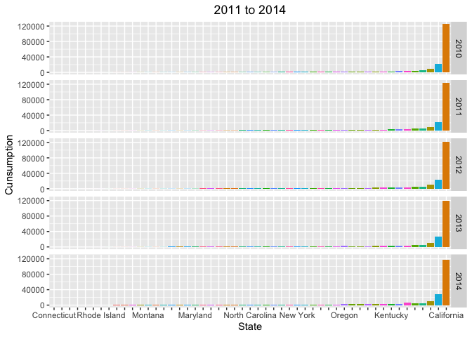<!-- -->

``` r
#Top 5 States in GeoC2010
GeoC2010<-Geo%>%
  filter(Year==2010)%>%
  arrange(desc(GeoConsumption))%>%
  slice(1:5)%>%
  ggplot(aes(x=reorder(State,GeoConsumption),y=GeoConsumption))+geom_col(aes(fill=State))+
  labs(
    title="2010",
    x="State",
    y="Cunsumption"
  )+
  theme(legend.position = 'none')+
  theme(plot.title = element_text(hjust = 0.5))+
  coord_flip()
GeoC2010
```

<!-- -->

``` r
#Top 5 States in Geo2011
GeoC2011<-Geo%>%
  filter(Year==2011)%>%
  arrange(desc(GeoConsumption))%>%
  slice(1:5)%>%
  ggplot(aes(x=reorder(State,GeoConsumption),y=GeoConsumption))+geom_col(aes(fill=State))+
  labs(
    title="2011",
    x="State",
    y="Cunsumption"
  )+
  theme(legend.position = 'none')+
  coord_flip()+
  theme(plot.title = element_text(hjust = 0.5)) 
GeoC2011
```

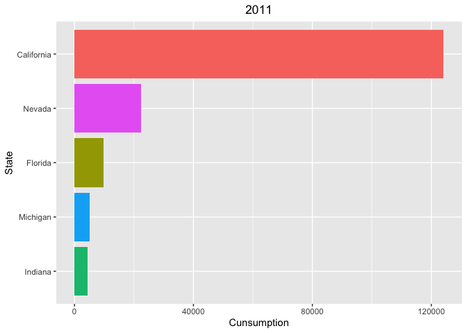<!-- -->

``` r
#Top 5 States in Geo2012
GeoC2012<-Geo%>%
  filter(Year==2012)%>%
  arrange(desc(GeoConsumption))%>%
  slice(1:5)%>%
  ggplot(aes(x=reorder(State,GeoConsumption),y=GeoConsumption))+geom_col(aes(fill=State))+
  labs(
    title="2012",
    x="State",
    y="Cunsumption"
  )+
  theme(legend.position = 'none')+
  coord_flip()+
  theme(plot.title = element_text(hjust = 0.5)) 
GeoC2012
```

<!-- -->

``` r
#Top 5 Sates in Geo2013
GeoC2013<-Geo%>%
  filter(Year==2013)%>%
  arrange(desc(GeoConsumption))%>%
  slice(1:5)%>%
  ggplot(aes(x=reorder(State,GeoConsumption),y=GeoConsumption))+geom_col(aes(fill=State))+
  labs(
    title="2013",
    x="State",
    y="Cunsumption"
  )+
  theme(legend.position = 'none')+
  theme(plot.title = element_text(hjust = 0.5)) +
  coord_flip()
GeoC2013
```

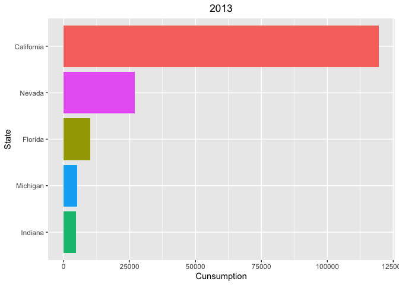<!-- -->

``` r
#Top 5 Sates in Geo2014
GeoC2014<-Geo%>%
  filter(Year==2014)%>%
  arrange(desc(GeoConsumption))%>%
  slice(1:5)%>%
  ggplot(aes(x=reorder(State,GeoConsumption),y=GeoConsumption))+geom_col(aes(fill=State))+
   labs(
    title="2014",
    x="State",
    y="Cunsumption"
  )+
  theme(legend.position = 'none')+
  theme(plot.title = element_text(hjust = 0.5))+
  coord_flip()
GeoC2014
```

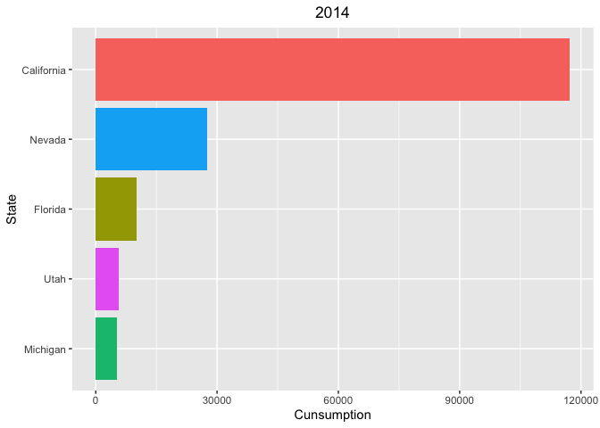<!-- -->

``` r
#Combine all together
ggarrange(GeoCgeneral,GeoC2010,GeoC2011,GeoC2012,GeoC2013,GeoC2014,nrow=2,ncol=3)
```

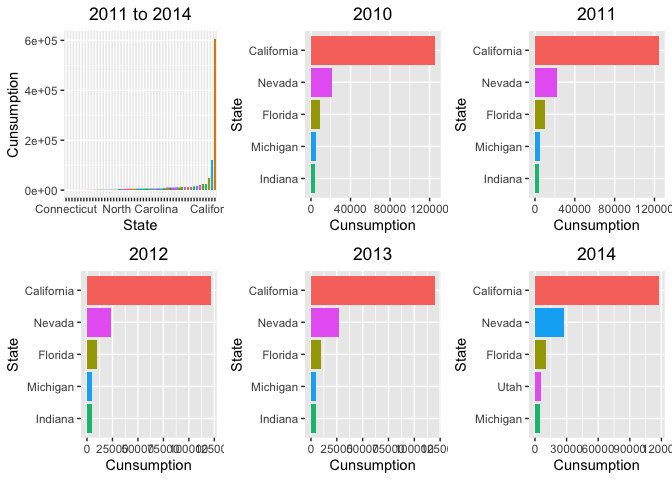<!-- -->

``` r
#Boxplot to show mean, median, min, max for each energy by coasts annually
# is_outlier that will return a boolean TRUE/FALSE if the value passed to it is an outlier. 
is_outlier <- function(x) {
  return(x < quantile(x, 0.25) - 1.5 * IQR(x) | x > quantile(x, 0.75) + 1.5* IQR(x))
}


#General
GeoCboxgeneral<-Geo%>%
  mutate(outlier = ifelse(is_outlier(GeoConsumption),State, as.numeric(NA))) %>%
  ggplot(aes(x=Year,y=GeoConsumption,fill=Year))+geom_boxplot(outlier.colour="red", outlier.shape=8, outlier.size=4)+
  labs(
    title="Boxplot for Geo Conumption from 2010 to 2014",
    x="Year",
    y="Consumption",
  )+
  geom_text(aes(label = outlier,color=outlier), na.rm = TRUE, hjust = -0.5)+
  geom_jitter()+
  theme(plot.title = element_text(hjust = 0.5))
GeoCboxgeneral
```

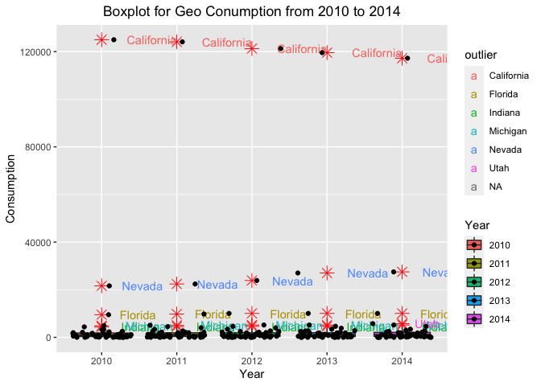<!-- -->

``` r
#2010
GeoCbox2010<-Geo%>%
  filter(Year==2010)%>%
  ggplot(aes(x=factor(Region),y=GeoConsumption,fill=factor(Region)))+geom_violin()+
  labs(
    title="Violin Boxplot for Geo Conumption in 2010 Based on Region",
    x="Region",
    y="Consumption",
  )+
  theme(plot.title = element_text(hjust = 0.5))
GeoCbox2010
```

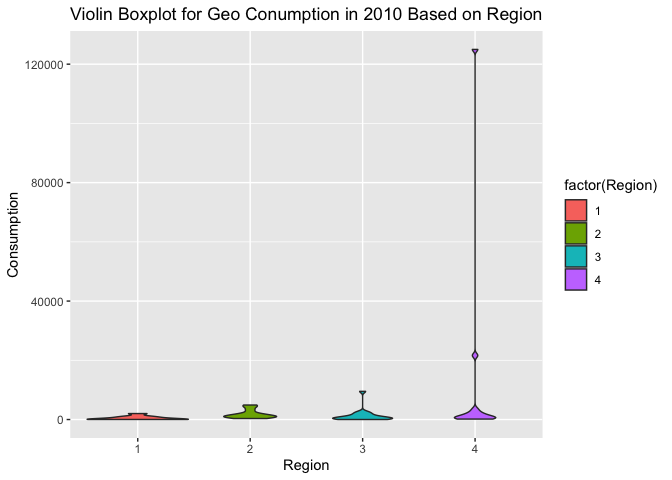<!-- -->

``` r
#2011
GeoCbox2011<-Geo%>%
  filter(Year==2011)%>%
  ggplot(aes(x=factor(Region),y=GeoConsumption,fill=factor(Region)))+geom_violin()+
  labs(
    title="Violin Boxplot for Geo Conumption in 2011 Based on Region",
    x="Region",
    y="Consumption",
  )+
  theme(plot.title = element_text(hjust = 0.5))
GeoCbox2011
```

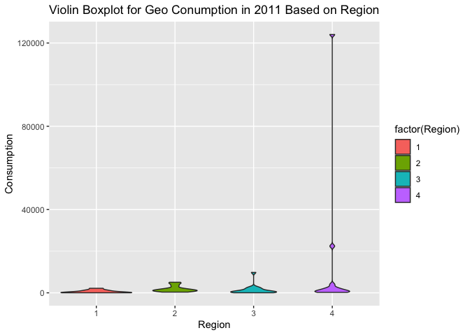<!-- -->

``` r
#2012
GeoCbox2012<-Geo%>%
  filter(Year==2012)%>%
  ggplot(aes(x=factor(Region),y=GeoConsumption,fill=factor(Region)))+geom_violin()+
  labs(
    title="Violin Boxplot for Geo Conumption in 2012 Based on Region",
    x="Region",
    y="Consumption",
  )+
  theme(plot.title = element_text(hjust = 0.5))
GeoCbox2012
```

<!-- -->

``` r
#2013
GeoCbox2013<-Geo%>%
  filter(Year==2013)%>%
  ggplot(aes(x=factor(Region),y=GeoConsumption,fill=factor(Region)))+geom_violin()+
  labs(
    title="Violin Boxplot for Geo Conumption in 2013 Based on Region",
    x="Region",
    y="Consumption",
  )+
  theme(plot.title = element_text(hjust = 0.5))
GeoCbox2013
```

<!-- -->

``` r
#2014
GeoCbox2014<-Geo%>%
  filter(Year==2014)%>%
  ggplot(aes(x=factor(Region),y=GeoConsumption,fill=factor(Region)))+geom_violin()+
  labs(
    title="Violin Boxplot for Geo Conumption in 2014 Based on Region",
    x="Region",
    y="Consumption",
  )+
  theme(plot.title = element_text(hjust = 0.5))
GeoCbox2014
```

<!-- -->

``` r
#Combine all together
ggarrange(GeoCboxgeneral,GeoCbox2010,GeoCbox2011,GeoCbox2012,GeoCbox2013,GeoCbox2014,nrow=2,ncol=3)
```

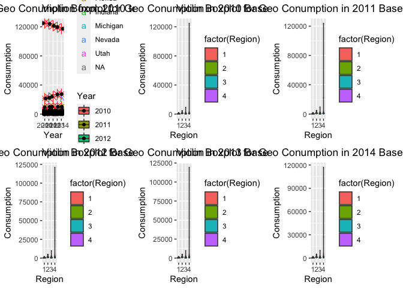<!-- -->

``` r
#Time series for Geo Consumption
Geo$Year=as.numeric(Geo$Year)
Geo%>%
  filter(StateCodes=="CA"|StateCodes=="FL"|State=="Michigan"|State=="Indiana"|State=="Nevada")%>%
  ggplot(aes(x = Year,y = CumGeoConsumption)) +geom_point(aes(color=factor(State))) +geom_line(aes(color=factor(State))) 
```

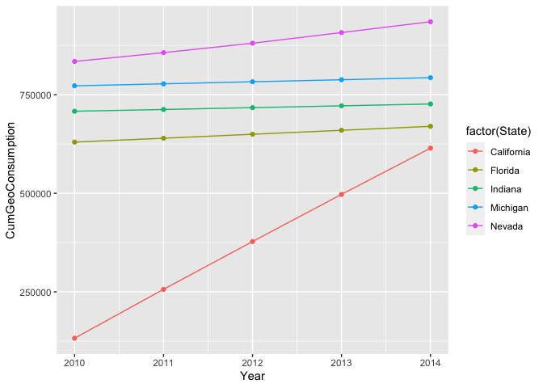<!-- -->

``` r
head(Geo)
```

    ## # A tibble: 6 × 11
    ##   StateCodes State   Region Division Coast `Great Lakes`  Year GeoConsumption
    ##   <chr>      <chr>    <dbl>    <dbl> <dbl>         <dbl> <dbl>          <dbl>
    ## 1 AL         Alabama      3        6     1             0  2010            138
    ## 2 AL         Alabama      3        6     1             0  2011            135
    ## 3 AL         Alabama      3        6     1             0  2012            141
    ## 4 AL         Alabama      3        6     1             0  2013            141
    ## 5 AL         Alabama      3        6     1             0  2014            141
    ## 6 AK         Alaska       4        9     1             0  2010            153
    ## # … with 3 more variables: GeoProduction <dbl>, CumGeoConsumption <dbl>,
    ## #   CumGeoProduction <dbl>

# Geo Production Visulization

``` r
#Rank top 5 state of Geo production each year. (Bar plot)
#Overall
GeoPgeneral<-ggplot(data=Geo,aes(y=GeoProduction,x=reorder(State,GeoProduction)))+geom_col(aes(fill=State))+
  scale_x_discrete(guide = guide_axis(check.overlap = TRUE))+
  labs(
    title="From 2011 to 2014",
    x="State",
    y="GeoProduction"
  )+
  theme(legend.position = 'none')+
  theme(plot.title = element_text(hjust = 0.5))
GeoPgeneral+facet_grid(Year ~.)
```

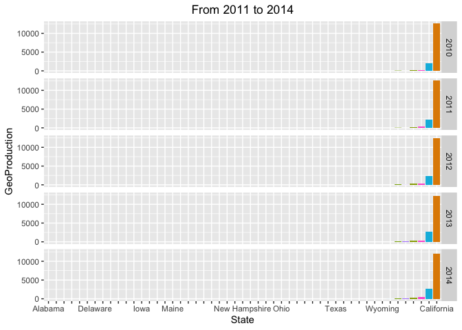<!-- -->

``` r
#Top 5 city in GeoP2010
GeoP2010<-Geo%>%
  filter(Year==2010)%>%
  arrange(desc(GeoProduction))%>%
  slice(1:5)%>%
  ggplot(aes(x=reorder(State,GeoProduction),y=GeoProduction))+geom_col(aes(fill=State))+
  labs(
    title="2010",
    x="State",
    y="Geo Production"
  )+
  theme(legend.position = 'none')+
  coord_flip()+
  theme(plot.title = element_text(hjust = 0.5))
GeoP2010
```

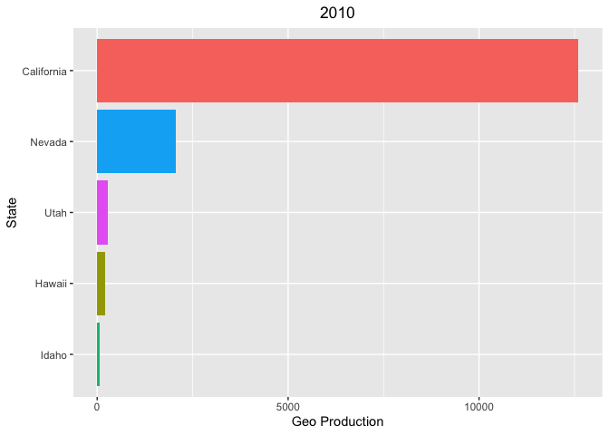<!-- -->

``` r
#Top 5 city in Geo2011
GeoP2011<-Geo%>%
  filter(Year==2011)%>%
  arrange(desc(GeoProduction))%>%
  slice(1:5)%>%
  ggplot(aes(x=reorder(State,GeoProduction),y=GeoProduction))+geom_col(aes(fill=State))+
  labs(
    title="2011",
    x="State",
    y="Geo Production"
  )+
  theme(legend.position = 'none')+
  theme(plot.title = element_text(hjust = 0.5))+
  coord_flip()
GeoP2011
```

<!-- -->

``` r
#Top 5 city in Geo2012
GeoP2012<-Geo%>%
  filter(Year==2012)%>%
  arrange(desc(GeoProduction))%>%
  slice(1:5)%>%
  ggplot(aes(x=reorder(State,GeoProduction),y=GeoProduction))+geom_col(aes(fill=State))+
  labs(
    title="2012",
    x="State",
    y="Geo Production"
  )+
  theme(legend.position = 'none')+
  theme(plot.title = element_text(hjust = 0.5))+
  coord_flip()
GeoP2012
```

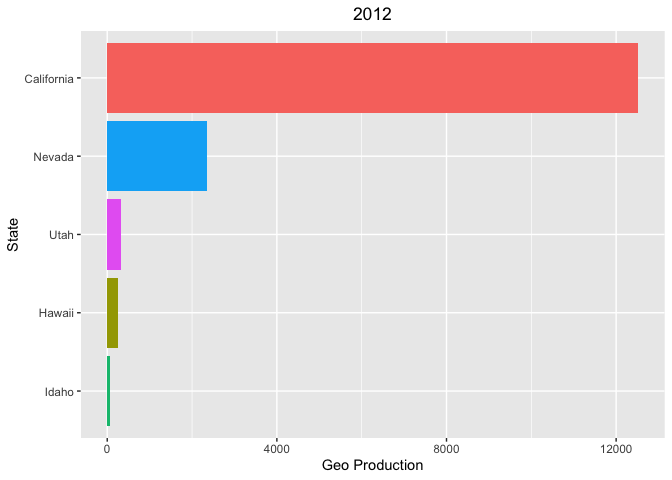<!-- -->

``` r
#Top 5 city in Geo2013
GeoP2013<-Geo%>%
  filter(Year==2013)%>%
  arrange(desc(GeoProduction))%>%
  slice(1:5)%>%
  ggplot(aes(x=reorder(State,GeoProduction),y=GeoProduction))+geom_col(aes(fill=State))+
  labs(
    title="2013",
    x="State",
    y="Geo Production"
  )+
  theme(legend.position = 'none')+
  theme(plot.title = element_text(hjust = 0.5))+
  coord_flip()
GeoP2013
```

<!-- -->

``` r
#Top 5 city in Geo2014
GeoP2014<-Geo%>%
  filter(Year==2014)%>%
  arrange(desc(GeoProduction))%>%
  slice(1:5)%>%
  ggplot(aes(x=reorder(State,GeoProduction),y=GeoProduction))+geom_col(aes(fill=State))+
  labs(
    title="2014",
    x="State",
    y="Geo Production"
  )+
  theme(legend.position = 'none')+
  theme(plot.title = element_text(hjust = 0.5))+
  coord_flip()
GeoP2014
```

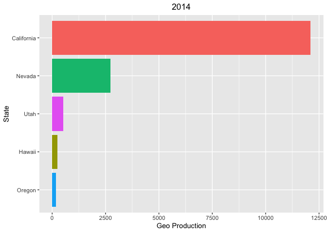<!-- -->

``` r
#Combine all together
ggarrange(GeoPgeneral,GeoP2010,GeoP2011,GeoP2012,GeoP2013,GeoP2014,nrow=2,ncol=3)
```

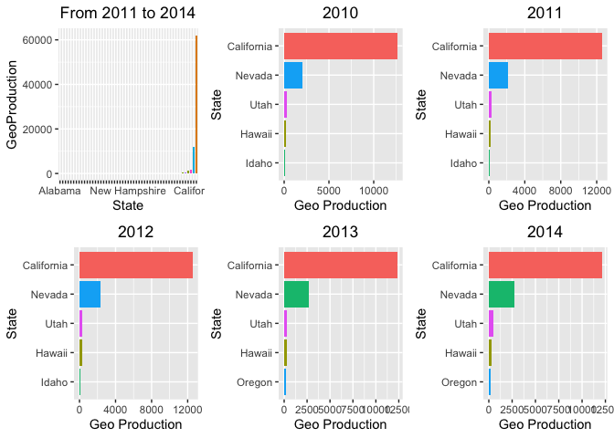<!-- -->

``` r
#Boxplot to show mean, median, min, max for each energy by coasts annually
Geo$Year=as.character(Geo$Year)
# is_outlier that will return a boolean TRUE/FALSE if the value passed to it is an outlier. 
is_outlier <- function(x) {
  return(x < quantile(x, 0.25) - 1.5 * IQR(x) | x > quantile(x, 0.75) + 1.5* IQR(x))
}
#General
GeoPboxgeneral<-Geo%>%
  mutate(outlier = ifelse(is_outlier(GeoProduction),State, as.numeric(NA))) %>%
  ggplot(aes(x=Year,y=GeoProduction,fill=Year))+geom_boxplot(outlier.colour="red", outlier.shape=8, outlier.size=4) + 
  geom_jitter()+
  labs(
    title="Boxplot for Geo Production from 2010 to 2014",
    x="Year",
    y="Production",
  )+
  geom_text(aes(label = outlier,color=outlier), na.rm = TRUE, hjust = 0.1)+
  theme(plot.title = element_text(hjust = 0.5))
  
GeoPboxgeneral
```

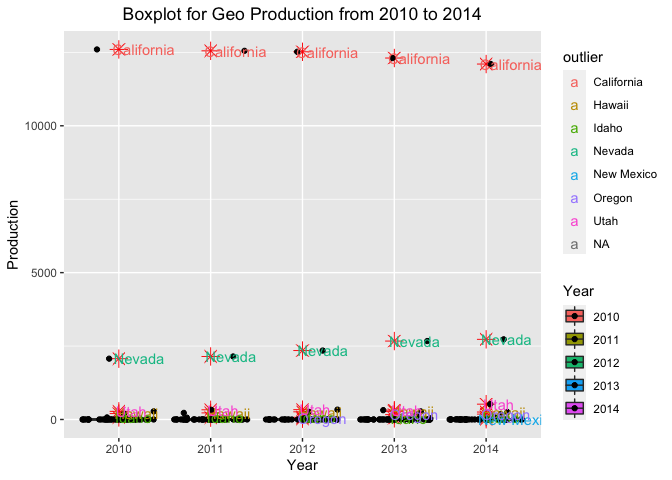<!-- -->

``` r
#2010
GeoPbox2010<-Geo%>%
  filter(Year==2010)%>%
  ggplot(aes(x=factor(Region),y=GeoProduction,fill=factor(Region)))+geom_violin()+
  labs(
    title="Violin Boxplot for Geo Production in 2010 Based on Region",
    x="Region",
    y="Production",
  )+
  theme(plot.title = element_text(hjust = 0.5))

GeoPbox2010
```

<!-- -->

``` r
#2011
GeoPbox2011<-Geo%>%
  filter(Year==2010)%>%
  ggplot(aes(x=factor(Region),y=GeoProduction,fill=factor(Region)))+geom_violin()+
  labs(
    title="Violin Boxplot for Geo Production in 2011 Based on Region",
    x="Region",
    y="Production",
  )+
  theme(plot.title = element_text(hjust = 0.5))
GeoPbox2011
```

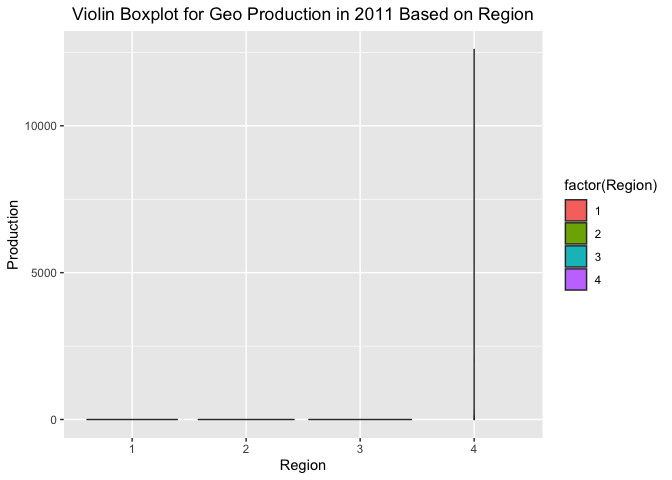<!-- -->

``` r
#2012
GeoPbox2012<-Geo%>%
  filter(Year==2010)%>%
  ggplot(aes(x=factor(Region),y=GeoProduction,fill=factor(Region)))+geom_violin()+
  labs(
    title="Violin Boxplot for Geo Production in 2012 Based on Region",
    x="Region",
    y="Consumption",
  )+
  theme(plot.title = element_text(hjust = 0.5))
GeoPbox2012
```

<!-- -->

``` r
#2013
GeoPbox2013<-Geo%>%
  filter(Year==2010)%>%
  ggplot(aes(x=factor(Region),y=GeoProduction,fill=factor(Region)))+geom_violin()+
  labs(
    title="Violin Boxplot for Geo Production in 2013 Based on Region",
    x="Region",
    y="Production",
  )+
  theme(plot.title = element_text(hjust = 0.5))
GeoPbox2013
```

<!-- -->

``` r
#2014
GeoPbox2014<-Geo%>%
  filter(Year==2010)%>%
  ggplot(aes(x=factor(Region),y=GeoProduction,fill=factor(Region)))+geom_violin()+
  labs(
    title="Violin Boxplot for Geo Production in 2014 Based on Region",
    x="Region",
    y="Production",
  )+
  theme(plot.title = element_text(hjust = 0.5))
GeoPbox2014
```

<!-- -->

``` r
#Combine all together
ggarrange(GeoPboxgeneral,GeoPbox2010,GeoPbox2011,GeoPbox2012,GeoPbox2013,GeoPbox2014,nrow=2,ncol=3)
```

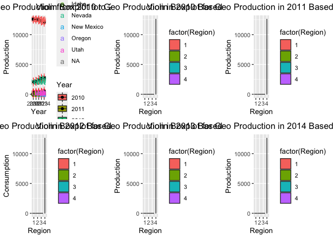<!-- -->

``` r
#Time series for Geo Production
Geo$Year=as.numeric(Geo$Year)
ggplot(Geo,aes(x = Year,y = CumGeoProduction)) +geom_point(aes(color=factor(State))) +geom_line(aes(color=factor(State))) 
```

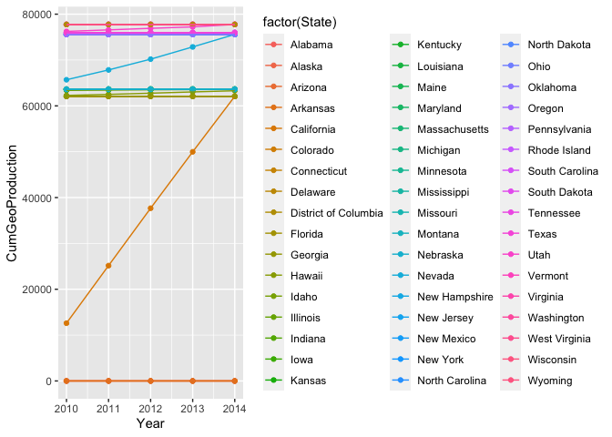<!-- -->
